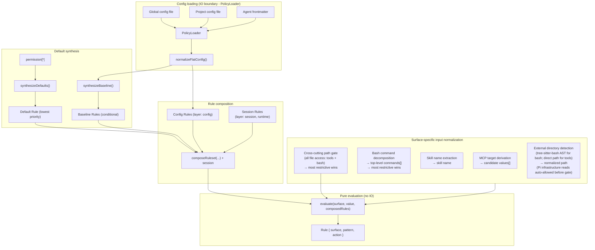
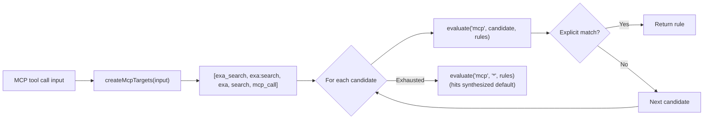
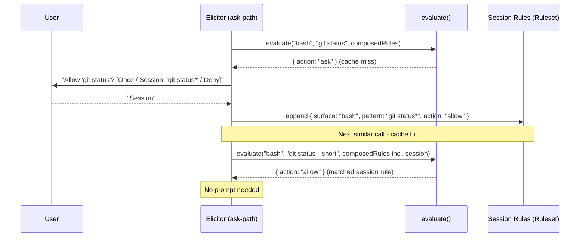
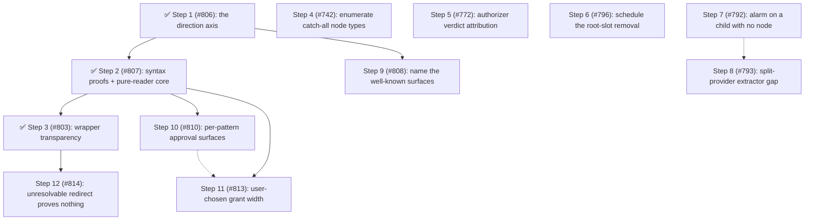

# Architecture

This document describes the internal design of the permission system, informed by [OpenCode's permission model](https://opencode.ai/docs/permissions/).

## Design principles

1. **Unified rule model** - one `Rule` type, one evaluation function, all surfaces.
2. **Pure evaluation** - permission decisions are pure functions of (surface, pattern, rules).
   IO stays at the edges.
3. **Session approvals are just more rules** - no separate matching engine, no separate pre-check.
4. **MCP stays special** - multi-name target derivation is pre-processing, not a special evaluation path.
5. **Defaults are rules** - the universal default (`permission["*"]`) is synthesized as a low-priority rule in the array.
   No side-channel fallbacks.
6. **Flat config format** - the flat `permission: { ... }` object where each key is a surface.
   The config IS the ruleset in human-friendly form.
   Capability is a suffix on the surface name, not a nested facet (`path_read`, `external_directory_write`), and a bare `path` / `external_directory` key is load-time sugar expanding into both directions — so every channel keeps speaking one flat `(surface, pattern)` vocabulary ([ADR-0013](../decisions/0013-permission-policy-model.md) §3, §4).
7. **Preserve the two-phase model** - tool filtering (before_agent_start) and invocation gating (tool_call) remain separate.
8. **Ask = cache miss** - "ask" is the absence of a matching rule.
   The human is the oracle.
   Their decision is a rule.
   Persistence determines lifetime (once / session / config).
9. **Single-agent core, multi-agent by extension** - Pi is single-agent by deliberate design; the notion of multiple named agents is introduced entirely by external extensions (pi-subagents, pi-agent-router, some MasuRii packages), not by Pi itself.
   Per-agent `permission:` frontmatter is therefore an extension bridge layered on this single-agent core, not a core responsibility.
   The package learns the active agent from a generic `<active_agent>` signal (a system-prompt tag or an `active_agent` session entry), never from a hard dependency on any one multi-agent extension, so the bridge works with any tool that emits the signal.

## Scope and non-goals

The README carries a short charter for the boundaries that come up most often.
This is the full inventory, with the decision record or design principle each rests on.

| Non-goal                                                                             | Rests on                                                                                |
| ------------------------------------------------------------------------------------ | --------------------------------------------------------------------------------------- |
| Implementing isolation — this decides and records; a sandbox contains                | [ADR-0013](../decisions/0013-permission-policy-model.md) §8                             |
| Deciding project trust — a policy enforcer, not a trust oracle                       | [ADR-0001](../decisions/0001-project-trust-adoption.md)                                 |
| Sanitizing the config merge so a project scope can only tighten                      | [ADR-0001](../decisions/0001-project-trust-adoption.md)                                 |
| Shipping permissive defaults, trust profiles, or workflow-mode presets               | Operator position; `docs/opencode-compatibility.md` divergence table                    |
| Built-in secret or sensitive-path denylists                                          | [ADR-0010](../decisions/0010-permission-log-secret-exposure.md)                         |
| Value-shape or entropy secret detection in the logs                                  | [ADR-0010](../decisions/0010-permission-log-secret-exposure.md)                         |
| Redacting the permission prompt or the forwarded request                             | [ADR-0010](../decisions/0010-permission-log-secret-exposure.md)                         |
| Disabling the review log by default, or gating `command` behind a flag               | [ADR-0010](../decisions/0010-permission-log-secret-exposure.md)                         |
| A downstream log-redactor registry                                                   | [ADR-0010](../decisions/0010-permission-log-secret-exposure.md)                         |
| Reading ambient host state (`cygpath`, MSYS detection) to interpret paths            | [ADR-0003](../decisions/0003-git-bash-posix-path-semantics.md)                          |
| Per-command argument tables in the deterministic bash layer                          | [ADR-0009](../decisions/0009-bash-path-projection-completeness-contract.md)             |
| Flooring every unprovable bash token to `ask`                                        | [ADR-0009](../decisions/0009-bash-path-projection-completeness-contract.md)             |
| Making the permission manager path-aware                                             | [ADR-0002](../decisions/0002-path-values-string-boundary.md), lint-guarded              |
| Making an LLM call, or holding model provider/prompt/threshold config                | [ADR-0007](../decisions/0007-model-judge-authorizer-chain-adr.md) §5                    |
| Letting an authorizer link `allow` on `external_directory` or a secret-shaped `path` | [ADR-0007](../decisions/0007-model-judge-authorizer-chain-adr.md) §5                    |
| Opt-out authorizer activation                                                        | [ADR-0007](../decisions/0007-model-judge-authorizer-chain-adr.md) §4                    |
| Running authorizer links on a relaying node, or a process-global registry            | [ADR-0007](../decisions/0007-model-judge-authorizer-chain-adr.md) §7                    |
| Re-deriving a forwarded request's facts at the parent                                | [ADR-0008](../decisions/0008-cross-session-access-intent.md)                            |
| A permanently tolerant dual-path wire, or a hard deny on a skewed request            | [ADR-0008](../decisions/0008-cross-session-access-intent.md) §4                         |
| Truncating or width-capping the assembled prompt message                             | [ADR-0011](../decisions/0011-prompt-presentation-contract.md) §2                        |
| Broadcasting evidence or annotations on `permissions:ui_prompt`                      | [ADR-0011](../decisions/0011-prompt-presentation-contract.md) §6                        |
| Returning model-generated annotations to the agent                                   | [ADR-0011](../decisions/0011-prompt-presentation-contract.md) §7                        |
| Echoing the agent's own tool input back in denial text                               | [ADR-0011](../decisions/0011-prompt-presentation-contract.md) §7                        |
| An in-package display for every operator's ideal (diffs, explanations)               | [ADR-0011](../decisions/0011-prompt-presentation-contract.md) §8                        |
| General agent steering from the permission dialog                                    | Operator position (issue #328)                                                          |
| Outbound bridges into another named extension's event contract                       | §"Beyond the target: a pluggable escalation seam", by analogy                           |
| A yolo mode that overrides explicit denies                                           | §"yolo is recorded authority"                                                           |
| A hard dependency on any one multi-agent extension                                   | Design principle 9                                                                      |
| A special evaluation path for MCP, or side-channel fallbacks                         | Design principles 4 and 5                                                               |
| OpenCode's top-level `"permission": "allow"` string shorthand                        | `docs/opencode-compatibility.md` divergence table                                       |
| A model that classifies access intent before `evaluate()`                            | §"Beyond the target"; [ADR-0007](../decisions/0007-model-judge-authorizer-chain-adr.md) |

Two entries rest on an operator position rather than a decision record, and are marked as such above.

The following are **not** boundaries, and must not be written as such.
Durable persistence of an approval is anticipated by design principle 8 and §"Authority lives in three places", which reserve a place for a ruling that outlives the session.
Whether a capability model replaces the actor-keyed surface list is settled: [ADR-0013](../decisions/0013-permission-policy-model.md) adds read/write capability as an axis beside the existing keys, so direction becomes expressible on `path` and on the boundary.
Which channels policy may enter through remains open in issue #799.
Multi-hop escalation, three-way grant scope, terminal-replacement registration, and non-TUI presentation are admitted-not-shipped or externally blocked, not declined.

## Core data model

### Rule

```typescript
/**
 * Provenance of a rule - which source contributed it.
 *
 * Config scopes: "global", "project", "agent", "project-agent".
 * Synthesized:   "builtin" (universal default / evaluate() fallback),
 *                "baseline" (conditional MCP metadata auto-allow).
 * Runtime:       "session" (session approvals).
 * Rewrite:       "yolo" (composition-stage ask→allow rewrite under yolo mode),
 *                "fail-closed" (composition-stage allow→ask floor when an
 *                invalid non-global config scope is detected).
 */
type RuleOrigin =
  | "global"
  | "project"
  | "agent"
  | "project-agent"
  | "builtin"
  | "baseline"
  | "session"
  | "yolo"
  | "fail-closed";

interface Rule {
  /** The permission surface: "bash", "edit", "mcp", "skill", "external_directory", "path", etc. */
  surface: string;
  /** The match pattern: a command glob, tool name, file path, skill name, or "*". */
  pattern: string;
  /** The decision. */
  action: PermissionState;
  /** Custom denial reason for deny rules (optional). */
  reason?: string;
  /**
   * Origin layer - used to derive PermissionCheckResult.source after evaluation.
   * Not used by evaluate(); purely informational metadata.
   */
  layer?: "default" | "baseline" | "config" | "session";
  /** Which source contributed this rule. */
  origin: RuleOrigin;
}
```

Every config entry, default policy, session approval, and agent override normalizes into `Rule[]`.

### Ruleset

```typescript
type Ruleset = Rule[];
```

Merge precedence is array ordering.
The synthesized universal default goes first (lowest priority), then MCP baseline auto-allow rules, then config rules (global → project → agent → project-agent), and finally session rules (highest priority).
Last-match-wins: `evaluate()` scans from the end.

### Evaluate

```typescript
function evaluate(
  surface: string,
  value: string,
  rules: Ruleset,
  platform: NodeJS.Platform,
): Rule {
  for (let i = rules.length - 1; i >= 0; i--) {
    const rule = rules[i];
    // On win32 a path-surface match folds case + separators; `platform` is
    // injected from `PermissionManager` (read once at the composition root,
    // #510), never `process.platform` ambiently.
    if (ruleMatches(rule, surface, value, platform)) {
      return rule;
    }
  }
  // Unreachable when defaults are synthesized - the catch-all always matches.
  return { surface, pattern: value, action: "ask" };
}
```

The entire decision engine.
When defaults are synthesized into the array, the catch-all `{ surface: "*", pattern: "*", action: "ask" }` always matches - the fallback return is defensive only.

## Composed ruleset

All rule sources are concatenated into a single flat array.
Index position determines priority (higher index wins):

```text
  ┌─────────────────────────────────────────────────────────────────┐
  │                     Composed Ruleset (Rule[])                   │
  │                                                                 │
  │  Index 0: Synthesized universal default (layer: "default")      │
  │    { surface: "*", pattern: "*", action: permission["*"] }      │
  │                                                                 │
  │  Index 1..B: MCP baseline auto-allow (layer: "baseline")        │
  │    (only when any config rule has surface:"mcp" action:"allow") │
  │    { surface: "mcp", pattern: "mcp_status",   action: "allow" } │
  │    { surface: "mcp", pattern: "mcp_list",     action: "allow" } │
  │    { surface: "mcp", pattern: "mcp_search",   action: "allow" } │
  │    { surface: "mcp", pattern: "mcp_describe", action: "allow" } │
  │    { surface: "mcp", pattern: "mcp_connect",  action: "allow" } │
  │                                                                 │
  │  Index B+1..C: Config rules (global → project → agent,         │
  │                   layer: "config", origin: "global"|"project"   │
  │                   |"agent"|"project-agent")                     │
  │    { surface: "bash",  pattern: "*",     action: "allow",       │
  │      origin: "global" }                                         │
  │    { surface: "bash",  pattern: "git *", action: "allow",       │
  │      origin: "global" }                                         │
  │    { surface: "bash",  pattern: "rm *",  action: "deny",        │
  │      origin: "project" }                                        │
  │    { surface: "read",  pattern: "*",     action: "allow",       │
  │      origin: "global" }                                         │
  │    { surface: "mcp",   pattern: "exa:*", action: "allow",       │
  │      origin: "agent" }                                          │
  │                                                                 │
  │  Index C+1..end: Session rules (layer: "session", highest)      │
  │    { surface: "external_directory", pattern: "/other/*",        │
  │      action: "allow" }                                          │
  │                                                                 │
  │  ◄── evaluate() scans from end, first match wins ──►            │
  └─────────────────────────────────────────────────────────────────┘
```

`synthesizeDefaults()` produces a single universal catch-all from `permission["*"]`.
Per-surface catch-alls (e.g. `bash: { "*": "allow" }`) are expressed as regular config rules via `normalizeFlatConfig()` - no separate override layer is needed.

`synthesizeBaseline()` conditionally emits MCP metadata auto-allow rules.

`composeRuleset()` concatenates: defaults + baseline + config rules.
Session rules are concatenated after config rules so `evaluate()` handles them via last-match-wins - no separate per-branch pre-check.

### Default synthesis

```typescript
// Single universal catch-all from permission["*"].
function synthesizeDefaults(universalDefault: PermissionState): Ruleset {
  return [
    { surface: "*", pattern: "*", action: universalDefault, layer: "default" },
  ];
}

// MCP metadata auto-allow - only synthesized when any config rule has
// surface: "mcp" && action: "allow".
function synthesizeBaseline(configRules: Ruleset): Ruleset { ... }

// Concat in priority order: defaults, baseline, config.
function composeRuleset(defaults, baseline, config): Ruleset {
  return [...defaults, ...baseline, ...config];
}
```

## Architecture overview



The `Agent frontmatter` input (`AF`) is the per-agent override layer.
It only carries data when an external multi-agent extension is active (see design principle 9): the package resolves the active agent's name from a generic `<active_agent>` signal, then reads the `permission:` sub-document of that agent's definition file at `<cwd>/.pi/agents/<name>.md` (project) or `<agentDir>/agents/<name>.md` (global).
The package does not discover or enumerate agents — it reads one sub-document by name, on demand — and the `<cwd>/.pi/agents` location is a Pi platform convention this package encodes independently (no dependency on pi-subagents, ADR 0002).

## Config format

```jsonc
{
  "permission": {
    "*": "ask",
    "read": "allow",
    "bash": { "*": "allow", "git *": "allow", "npm *": "allow", "rm *": "deny" },
    "mcp": { "*": "ask", "exa:*": "allow" },
    "skill": { "*": "ask", "librarian": "allow" },
    "path": { "*": "allow", "*.env": "deny" },
    "external_directory": "ask"
  }
}
```

Each top-level key in `permission` is a surface name.
A string value is shorthand for `{ "*": action }` (surface-level catch-all).
An object value maps patterns to actions.
`permission["*"]` is the universal fallback.

### Normalization to Rule[]

`normalizeFlatConfig` (`src/normalize.ts`) flattens each `permission` entry into `Rule`s: a string value expands to a single surface catch-all (`{ surface, pattern: "*", action }`), and an object value expands each `pattern → action` pair to one `Rule`.

Ahead of it, `expandDirectionalSugar` runs once per scope inside `mergeScopesWithOrigins`, rewriting a bare `path` / `external_directory` key into its two directional members so origins stay attributed to the authoring scope.
After expansion no rule lives on a bare family surface; `PermissionResolver.resolve` answers a bare-family query by folding the members most-restrictive.

## MCP pre-processing

MCP is the one surface that requires pre-processing **before** evaluation.
The multi-name target derivation stays, but it feeds candidate values into `evaluate()` rather than a separate code path:



The priority ordering of candidates is preserved.
The evaluation function is unchanged - MCP just calls it multiple times with different values.
MCP target derivation helpers live in `src/access-intent/mcp-targets.ts`.
Input normalization for all surfaces lives in `src/access-intent/input-normalizer.ts`.

### Path-bearing tool normalization

Per-tool path patterns — e.g. `"read": { "*": "allow", "*.env": "deny" }` — are evaluated via the `access-path` intent the per-tool gate emits ([#502]).
When the pipeline calls `resolvePerToolCheck`, a present `input.path` triggers `normalizer.forPath(path)` and an `access-path` intent on the tool-name surface; the resolver unwraps it to `path-values` carrying the lexical ∪ canonical alias set before the manager evaluates the rule.
When `input.path` is missing or empty, the pipeline falls back to a `tool` intent, which `normalizeInput` collapses to `["*"]` (surface catch-all).
Path alias derivation (home-expansion, cwd-relative aliases) lives in `getPathPolicyValues` / `AccessPath` — not in `normalizeInput`, which no longer touches path surfaces (#504).
`getToolPermission()` is unaffected — it always evaluates with `"*"` to determine whether to inject the tool at agent start.

The cross-cutting `path` and `external_directory` gates extract paths for **extension and MCP tools too** (#352): `describePathGate` and `describeExternalDirectoryGate` call `getToolInputPath`, which reads `input.path` for built-ins, `input.arguments.path` for MCP, and a registered `ToolAccessExtractor` (or the default `input.path` convention) for any other tool.
The extractor registry (`src/tool-access-extractor-registry.ts`) is created once in `index.ts` and shared: its lookup side is threaded into `ToolCallGatePipeline`, and its registrar side is exposed cross-extension via `PermissionsService.registerToolAccessExtractor`.
Per-tool path maps for extension tools (a custom extractor key per tool) are a deferred follow-up.

On the bash side, which argument tokens count as filesystem operands is settled by [ADR 0009](../decisions/0009-bash-path-projection-completeness-contract.md): candidacy comes from the filesystem (a bare token is a path candidate iff it names an existing entry), the decision comes from explicit rules or the external boundary, and the ADR names both what the projection guarantees and which gaps are accepted residuals rather than bugs.
A plain `$HOME` / `${HOME}` / `$PWD` / `${PWD}` reference is resolved at token collection, upstream of classification, so an expanded token is gated exactly as its literal spelling; the resolvable set is closed at those two names by the same ADR.

## Session approvals: the cache-miss model

Session rules are stored as `Ruleset` and are generalized to all surfaces.

`evaluate()` is a **lookup** against cached decisions.
When no rule matches (or the matching rule says "ask"), the system has a cache miss - it needs the human oracle to produce a decision.

The human's response is simultaneously:

1. **The answer** for this request (allow or deny).
2. **A rule** that can be cached for future lookups.

The dialog determines **persistence** - where the rule lives:

```text
  evaluate(surface, value, composedRules)
       │
       ├── match.action = "allow" → proceed (cache hit)
       ├── match.action = "deny"  → block (cache hit)
       │
       └── match.action = "ask"   → cache miss, query oracle
                │
                ▼
           Dialog: "[surface] wants to [value]"
                │
                ├── "Yes"              → allow this request (no persistence)
                ├── "Yes, for session" → allow + store in session layer
                │                        (future lookups hit without asking)
                ├── "No"               → deny this request (no persistence)
                └── (future: "Always") → allow + store in config layer (disk)
```

### Pattern suggestions

When prompting, each surface suggests a **pattern** for the "for session" option.
The pattern determines what class of future requests auto-approve:

| Surface                | Input value                 | Suggested session pattern   | Mechanism                |
| ---------------------- | --------------------------- | --------------------------- | ------------------------ |
| bash                   | `git checkout main`         | `git checkout *`            | Arity table              |
| bash                   | `npm run dev`               | `npm run dev`               | Arity table              |
| tool (read/write/etc.) | tool surface itself         | `*` (all uses of that tool) | Tool-level               |
| mcp                    | `exa:search`                | `exa:*`                     | Server-level wildcard    |
| skill                  | `librarian`                 | `librarian`                 | Exact name               |
| external_directory     | `/other/project/src/foo.ts` | `/other/project/*`          | Directory prefix as glob |

The suggestion is shown in the dialog text so the user sees what they're approving:

```text
  ● Allow once
  ● Allow "git checkout *" for this session
  ● Deny
```

### Implementation



## Prompt presentation

What a prompt must show, what a renderer may elide, and what bounds its size are settled by [ADR 0011](../decisions/0011-prompt-presentation-contract.md).
The contract in one line: **the payload is complete, and elision is a property of a render, never of the payload**.

A gate emits structured facts rather than a sentence.
The payload's `request` group — requester and forwarded-ness, tool name and invoked tool name, gate surface and matched rule, the decision-relevant value, and for bash the unit that will actually run — is never elided by any renderer.
`evidence` is complete on the payload and elided to fit each renderer's budget, with the elision marked but uncounted; an operator must still be able to reach the complete information while the decision is pending.
The dialog is bounded by a row budget plus a per-field width cap, the review log by its own configured limits, and the `permissions:ui_prompt` broadcast receives the `request` facts only — the narrowest renderer, because the bus is the one channel an extension observes without the operator having named it.
Denial text is a fifth render of the same facts under one extra rule: it identifies the call rather than reproducing it, since the agent already holds its own tool input.

The payload exists, and the human-facing renderers are bounded.
Every gate emits a `PromptPayload` (`src/presentation/`), and `PromptPermissionDetails` requires one, so the six former assembly sites are gone.
`renderPromptDialog` renders it for the inline dialog and the `select`/`input` fallback under `promptMaxRows` plus `promptFieldMaxWidth`, and `Ctrl+O` expands the dialog to the complete request.
The cap applies to the `request` facts too: never elided means never *omitted* — a long one is shortened, marked, and reachable in full rather than dropped.
Without that reading a bounded render is unreachable, since the decision-relevant value is itself the pathological field in the reported case ([#710]).
A fact an adjacent line already states is not repeated — a bash ask's gate surface is its tool name, and a path ask's is the word its value line is labelled with — so the render spends a line only where it adds something.
That is a redundancy rule, not an elision: the fact is still on screen, which is what §3 requires.

The two cross-boundary contracts now carry facts rather than prose.
The forwarded-request wire carries the child's `PromptPayload`, so the serving node renders the child's own facts under the *parent's* budget — a forwarded bash ask reads `command : …` exactly as a local one does, and `kind: "forwarded"` narrows to meaning one thing: this ask arrived without a payload.
`permissions:ui_prompt` carries `request`, the payload's invariant core, and no evidence at all, which makes the bus the narrowest renderer (ADR 0011 §6): any loaded extension observes it without the operator having named that extension.
`toolInputPreviewMaxLength` and `toolTextSummaryMaxLength` are deprecated and ignored, superseded by the renderer budgets.

The last two consumers are renderers too, so the flat `message` string is gone.
The agent-facing text identifies a refused call rather than reproducing it (§7): it names the surface, the tool, the rule with its nested context, the flagged path or target or skill, and the operator's or human's reason — never the bash command, which is the payload that took over the viewport in [#710] and the agent's context window on every denial.
The flagged element is agent input, so it is capped rather than structurally bounded; naming it is what makes a denial correctable, since which of a call's operands a rule fired on is below tool-call granularity and the agent cannot recover it from its own arguments.
The review log persists the payload's request facts rather than the prompt sentence — stamped by `GateRunner` beside the request id, so no gate can forget them — and every string it writes is narrowed to `reviewLogFieldMaxWidth`.
That bound lives in `writeLine` beside the key-name mask, which makes the log's growth a decision the operator makes rather than a consequence of how long a command happened to be.
ADR 0011 records what each dependent item becomes under the contract.

## Two-phase checking

### Phase 1: Tool filtering (`before_agent_start`)

`shouldExposeTool` (`src/handlers/before-agent-start.ts`) calls `evaluate(toolName, "*", rules)` and exposes the tool unless the surface-level result is `deny` — "is this tool denied regardless of specific input?"

### Phase 2: Invocation gating (`tool_call`)

The gate pipeline (`src/handlers/gates/`) normalizes the input to `(surface, value)`, evaluates it against the composed ruleset, and acts on the result: `allow` proceeds, `deny` blocks, and `ask` elicits from the session's `Authorizer` — a persisted "session" decision appends a `Rule` to `sessionRules` so the next similar call is a cache hit.

Same `evaluate()`, same ruleset.
The only surface-specific logic is input normalization (what `surface` and `value` to look up) and pattern suggestion (what glob to offer for "session" approval).

`checkPermission()` uses a single evaluate path: `normalizeInput()` → `evaluateFirst()` → `deriveSource()` → single result object.

## Subagent detection and permission forwarding

When `ask`-state permissions arise in a headless subagent child process, the extension forwards the dialog to the parent session rather than silently denying.
This requires two detections:

1. **Is the current process a subagent?**
   - `isSubagentExecutionContext()` in `src/authority/subagent-context.ts`.
2. **What is the parent session ID?**
   - `resolvePermissionForwardingTargetSessionId()` in `src/authority/permission-forwarding.ts`.

### Known extension env var inventory

| Extension                                                                           | Child-process env vars                                                                    | Parent-session env var              |
| ----------------------------------------------------------------------------------- | ----------------------------------------------------------------------------------------- | ----------------------------------- |
| The adapter convention (new implementations)                                        | none required                                                                             | `PI_SUBAGENT_PARENT_SESSION`        |
| pi-agent-router (original)                                                          | `PI_IS_SUBAGENT`, `PI_SUBAGENT_SESSION_ID`, `PI_AGENT_ROUTER_SUBAGENT`                    | `PI_AGENT_ROUTER_PARENT_SESSION_ID` |
| [nicobailon/pi-subagents](https://github.com/nicobailon/pi-subagents)               | `PI_SUBAGENT_CHILD`, `PI_SUBAGENT_RUN_ID`, `PI_SUBAGENT_CHILD_AGENT`, `PI_SUBAGENT_DEPTH` | none set (see #98)                  |
| [tintinweb/pi-subagents](https://github.com/tintinweb/pi-subagents)                 | none - runs fully in-process via `createAgentSession()`                                   | n/a - deferred to #29               |
| [HazAT/pi-interactive-subagents](https://github.com/HazAT/pi-interactive-subagents) | `PI_SUBAGENT_NAME`, `PI_SUBAGENT_ID`, `PI_SUBAGENT_SESSION`, `PI_SUBAGENT_ACTIVITY_FILE`  | none set (see #98)                  |

### Detection (`isSubagentExecutionContext`)

`isSubagentExecutionContext()` checks three sources in priority order:

1. **Explicit registry** - the in-process half of the subagent adapter convention ([Subagent Integration](../subagent-integration.md#the-subagent-adapter-convention) is its canonical spec); the permission system's subscriber writes the entry into `SubagentSessionRegistry` synchronously.
   The registry (keyed by **child session id**) is checked first.
   Each concurrent sibling child of the same parent receives a unique session id from `sessionManager.newSession()`, so siblings occupy distinct keys - one sibling's `disposed` event cannot evict another's entry (fixes #298).
   The registry is a process-global singleton (via `getSubagentSessionRegistry()`, backed by `globalThis` + `Symbol.for()`) because each session's `ResourceLoader` creates its own `pi.events` bus: the parent's instance registers the child over the parent bus, while the child's separate jiti instance reads the same global store to detect itself and resolve its forwarding target.
2. **Env vars** (`SUBAGENT_ENV_HINT_KEYS`) - returns `true` when any key is set to a non-empty, non-whitespace value.
   Used by process-based subagent extensions.
   The list is composed from the per-extension markers plus `SUBAGENT_PARENT_SESSION_ENV_CANDIDATES`, since a process that names a parent session is a child by definition - which is what makes the convention's single out-of-process obligation sufficient on its own (#789).
3. **Filesystem path** - session-directory path-based fallback (child session dir is nested under `subagentSessionsDir`).

### Parent-session resolution (`resolvePermissionForwardingTargetSessionId`)

`resolvePermissionForwardingTargetSessionId()` checks two sources in priority order:

1. **Explicit registry** - if the caller provides a `sessionId` and `registry`, the registry entry's `parentSessionId` is returned when present.
   Used by in-process subagent extensions.
2. **Env vars** (`SUBAGENT_PARENT_SESSION_ENV_CANDIDATES`) - iterates candidates and returns the first non-empty, non-`"unknown"` value.
   Used by process-based subagent extensions.

Neither nicobailon nor HazAT sets a parent-session env var today, so forwarding still fails for those extensions with an explicit log message pointing to #98.
Adding a new env var candidate when an extension adopts the convention is a one-line change to the array.

### In-process case (resolved)

In-process subagent extensions (e.g. `@gotgenes/pi-subagents`) call `createAgentSession()` directly - no child process is spawned and no env vars are ever set.
The announcement they owe, and the pre-bind ordering that makes it usable, are specified by the adapter convention in [Subagent Integration](../subagent-integration.md#the-subagent-adapter-convention); `src/authority/subagent-lifecycle-events.ts` subscribes and writes/removes the entry in `SubagentSessionRegistry` synchronously.
The registry is process-global (see `getSubagentSessionRegistry()` in `src/authority/subagent-registry.ts`) so the child's separate jiti instance reads the same store as the parent.

### External convention guide

A [permission frontmatter convention guide](../guides/permission-frontmatter-for-subagent-extensions.md) documents how upstream subagent extensions can adopt the `permission:` frontmatter key as a shared convention.
This is a documentation-only proposal - no code dependency is required.
The guide covers the two-layer model, flat format reference, composition examples, and the optional event bus runtime integration.

## Cross-extension service accessor

The primary cross-extension API is a `Symbol.for()`-backed service object on `globalThis`.
The cross-node contract governing this surface is settled in [ADR 0012](../decisions/0012-cross-node-extension-contract.md); its decisions 2, 3, and 4 are implemented here.

Pi's extension loader creates a fresh jiti instance per extension with `moduleCache: false`, isolating module-scoped state.
`Symbol.for()` and `globalThis` are process-global by spec, so they survive this isolation.

One process can host several **nodes** — one Pi session runtime each, with its own `ExtensionContext`, event bus, gates, registries, and `PermissionSession`.
A root session and each of its in-process subagent children are separate nodes, and each loads its own instance of this extension.
Registrations never cross a node boundary: a child fixes an ask's facts and runs its own gates, so the extractors and formatters it needs are the ones registered in *its* registries, and chain links are consulted only by the node that adjudicates (ADR 0007 §7).

So each node publishes its `PermissionsService` at `session_start` into a process-global map keyed by its own session id, and a consumer resolves it with `getPermissionsService(sessionId)`.
The session id travels as data on the `permissions:ready` payload, alongside `adjudicatesLocally` — a registrant needs no branch on the latter, since a link registered where no chain runs is accepted and recorded rather than refused (decision 4, `authorizer_link_vacant` in the review log).
That payload is broadcast twice per session generation: at `session_start` after the node publishes, and again at the node's first `before_agent_start`, which runs after every extension's `session_start` and before any ask (decision 3, the ready latch).
So the channel fires at least once per session and may repeat, and the ready handler alone is a sufficient registration site — a consumer needs no second attempt from its own `session_start`, only an idempotence guard.
A node additionally publishes to a legacy single slot unless it is an in-process subagent child, which must not clobber its parent's (#302).
That slot backs `getRootPermissionsService()`, which is deprecated: it answers "the process root's service", which is the wrong node in every node but the root.
Calling it emits a once-guarded `DeprecationWarning` (`PI_PERMISSION_SYSTEM_DEP0001`); removal is deferred to a future major.
The locator's `sessionId` is required rather than optional, so a `PermissionsReadyEvent.sessionId` of `null` cannot fall through to the root slot; a caller the types cannot reach (JavaScript, or a consumer compiled against the pre-rename major) gets `undefined` plus a once-guarded `PI_PERMISSION_SYSTEM_WARN0001` warning rather than another node's service.
The `package.json` `exports` field's `default` condition points to `src/service.ts`, which contains the interface, the accessor functions, and the `Symbol.for()` key - no extension machinery.
The `types` condition instead resolves to a bundled `dist/public.d.ts` (built by `rollup-plugin-dts` from `rollup.dts.config.mjs`, published via `prepack`) so a downstream consumer's `tsc` never follows the raw `#src/*` module graph - only the `default` condition (the jiti runtime) reads `src/` directly (#592).

Both accessors come from `import("@gotgenes/pi-permission-system")`.
The `PermissionsService` interface exposes five methods:

- `checkPermission(surface, value?, agentName?)` - full policy query.
- `getToolPermission(toolName, agentName?)` - tool-level permission state (`allow`/`deny`/`ask`) for pre-filtering.
- `registerToolInputFormatter(toolName, formatter)` - register a custom ask-prompt preview for a tool name; returns a disposer (#283).
- `registerToolAccessExtractor(toolName, extractor)` - declare the filesystem path a non-conventional tool accesses, so the cross-cutting `path`/`external_directory` gates see it; returns a disposer (#352).
- `registerAuthorizer(name, authorize)` - register a named live-authority chain link (`allow | deny | defer`, ADR 0007 §4); decides nothing until the operator names it in `authorizerChain` config, and every verdict is capped by the bounded-delegation checkpoint; returns a disposer.

`permissions:decision` and `permissions:ui_prompt` broadcasts remain on the event bus - fire-and-forget observation is the right abstraction for those channels ([#531] removed the event-bus RPC channel; the service accessor is now the sole cross-extension policy/prompt surface).

## The authority model

This section records the organizing concept the package is built around — the spine the elicitation, forwarding, and yolo machinery collapse into — plus the still-open directions that extend it.
It is current state, not a target: the `Authorizer` interface, its three implementations, once-per-activation selection, `canConfirm()`'s dissolution, serving-as-resolution, human-selectable grant-scope, and the `authority/` directory migration all shipped in Phase 9 (see [history/phase-9-authorizer-spine.md](history/phase-9-authorizer-spine.md) for why the spine is the correct model of the `@gotgenes/pi-subagents` integration — the anonymous cross-session-authority recursion behind the [#296]/[#298]/[#302] bug history — and not merely an internal tidy).
Of the ["beyond the target"](#beyond-the-target-a-non-deterministic-access-intent-classifier) extension points below, the model-triage `Authorizer` chain is now implemented (Phase 12; [ADR 0007](../decisions/0007-model-judge-authorizer-chain-adr.md)), and its named-link registration subsumes the pluggable escalation seam; the deny-first slice is dogfooded by `packages/pi-permission-model-judge`, and the allow-capable opaque-bash adjudicator ([#620]) remains the sole open Track B slice.
A non-deterministic access-intent classifier remains aspirational.

### The spine

Every action resolves against an **authority** — an entity empowered to permit or forbid it.
The only questions are *which* authority and how we reach it.

This sharpens principle 8.
That principle calls the human "the oracle," borrowing the computer-science term for a black box consulted for an answer the system cannot compute.
But a permission decision is not epistemic (who *knows* the answer); it is deontic (who has the *right* to decide).
If a bystander happened to know what the user wanted, their saying "allow" would authorize nothing.
What makes a decision binding is authority, not knowledge — so the organizing concept is authority, and the entity that holds it is an **`Authorizer`**.
The human is merely the `Authorizer` at the interactive root; another agent can hold the role equally well.

### Authority lives in three places

1. **Recorded authority** — the ruleset.
   Config (durable, on disk), session rules (this session), and synthesized defaults/baseline are all prior rulings.
   `evaluate()` *is* "consult recorded authority": an `allow` or `deny` means recorded authority is sufficient, and the decision is final.
2. **Live authority** — reached only on `ask`, when recorded authority is silent.
   An entity empowered to rule *now*, reached through one of three channels (below).
3. **Absent authority** — nothing recorded, nothing reachable.
   Least privilege applies: no authority means the action is unauthorized, so it is denied.

The three are one thing at different lifetimes.
A live ruling, once persisted, *becomes* recorded authority — principle 8's "their decision is a rule."
The "for this session" dialog option writes a session rule; a future "always" writes config.

### The `Authorizer` role

On `ask`, the gate escalates to **one `Authorizer`, selected once per session from context**, and is told the decision.

1. **`LocalUserAuthorizer`** — the session has UI; prompt the human here.
2. **`ParentAuthorizer`** — the session is a subagent; escalate up the tree to the parent's authority.
3. **`DenyingAuthorizer`** — no authority is reachable; deny (least privilege).

There is no "can anyone answer" pre-check.
`canConfirm()` — today a boolean smeared across the gateway, prompter, and forwarder — dissolves: every `Authorizer` answers, the `DenyingAuthorizer` by denying.
The three context predicates (`hasUI`, `isSubagent`, yolo) are evaluated once, at selection, instead of repeatedly down the prompt path.

```text
evaluate(action, recorded authority)
  ├─ allow / deny ------------------> decided (recorded authority sufficient)
  └─ ask (recorded authority silent)
        └─ escalate to the session's Authorizer
              ├─ LocalUserAuthorizer -> prompt the human here
              ├─ ParentAuthorizer    -> forward up the tree, await the parent's ruling
              └─ DenyingAuthorizer    -> deny (no authority reachable)
                    |
              (a persisted ruling becomes recorded authority)
```

### The recursion

Authority is delegated **down** the session tree: the human drives the root, which spawns subagents that hold no inherent authority to approve a novel action.
So an `ask` a subagent cannot answer **escalates up** to where authority resides.
Permission-system instances form a tree mirroring the session tree, and `ParentAuthorizer` is the edge that routes a child's escalation toward the human at the root.
This is the same recursion pi-subagents describes (a subagent is a child Pi), viewed from the permission system's side: the package is itself one of the hooks on that child, and it recurses by forwarding.

### Reconstruction fidelity at the serving node

The courier hop carries facts, not judgment — but what the serving node reconstructs from a forwarded request differs by audience, and the two directions are the same rule applied to different trust boundaries.

An **in-process seam** — the `Authorizer` chain, reached through `PromptPermissionDetails` — receives the full child-fixed fact set.
A chain link is operator-opted-in via `authorizerChain` and must decide from evidence, not from parsed display text or a parent-side re-derivation of the child's path ([ADR 0008](../decisions/0008-cross-session-access-intent.md) forbids the latter outright).
The bounded-delegation checkpoint reads the same facts, so a forwarded ask is capped on the gate surface exactly as a local one is ([ADR 0007](../decisions/0007-model-judge-authorizer-chain-adr.md) §5).

A **cross-extension broadcast** — `permissions:ui_prompt` / `permissions:decision` on `pi.events` — receives the minimum needed to stay correlatable, because any loaded extension can observe it.

Maximum fidelity to the decider; minimum disclosure to the observer.
Requester identity (`requesterCwd`, `principal`) crosses to neither: it is the serving node's own resolution input (ADR 0008 §3) and stays on the wire object, with the ask details carrying only the `forwarding` provenance.

### yolo is recorded authority

yolo is not a channel and not a live concern — it is a standing authorization, and it belongs in the ruleset, not in the prompt path.
It is a composition-stage rewrite: when enabled, every `ask` action in the composed ruleset is rewritten to `allow`, tagged `origin: "yolo"` so the review log still distinguishes a yolo grant from a policy allow.

```typescript
const effective = yolo
  ? composed.map((r) => (r.action === "ask" ? { ...r, action: "allow", origin: "yolo" } : r))
  : composed;
```

This is faithful to current behavior exactly: explicit `deny` rules are not `ask`, so they pass through untouched — yolo suppresses prompts but **preserves hard denies**.
It honors principle 5 (defaults are rules; no side-channel fallbacks): `evaluate()` runs pure over the rewritten ruleset, and the prompt path loses all yolo knowledge (`shouldAutoApprovePermissionState` and `canResolveAskPermissionRequest`'s yolo arm dissolve).

The ruleset is the whole story for asks the ruleset produces.
An `ask` synthesized *after* resolution is not one: the bash wrapper floor (#481, #490) and the fail-closed `<unparseable-bash-command>` sentinel (#452) are properties of a parsed command unit, not of a pattern, so there is no rule for the rewrite to touch and they reached the prompter under yolo (#712).
A wrapper the floor no longer covers (#803) synthesizes nothing, so it never reaches that reconciliation at all — it is decided by an ordinary rule, on the inner command's text.
The reconciliation has exactly one home — `resolveYoloGrant` at `GateRunner`'s auto-approve fast path, the single choke point every gate passes through before escalating — so the contract "an `ask` never reaches `PermissionPrompter` under yolo" holds structurally for whatever floor is added next.
It is the same deny-preserving shape as the rewrite: a `deny` is not an `ask`, so it matches neither arm.
A future "disable everything" mode — overriding denies too — would be a *different*, deliberately named operation: appending a final `{ surface: "*", pattern: "*", action: "allow" }` rule (last-match-wins).
It is not built, and it would be requested by name, never conflated with yolo.

### Fail-closed on an invalid non-global scope

The mirror image of the yolo rewrite.
When a non-global config scope (project, agent, or project-agent) is present but fails to load or validate, the loader marks it invalid (`ScopeConfig.invalid`) instead of silently substituting an empty scope.
At composition the manager floors every `allow` in the composed ruleset to `ask`, tagged `origin: "fail-closed"`, so a permissive rule inherited from a lower-precedence scope cannot remain effective behind a higher scope that was meant to tighten it (#646).

```typescript
const effective =
  failClosedScopes.length > 0
    ? composed.map((r) => (r.action === "allow" ? { ...r, action: "ask", origin: "fail-closed" } : r))
    : composed;
```

Like yolo it is deny-preserving (only `allow` is touched) and applied at composition, so the display surfaces (`getComposedConfigRules`, `getToolPermission`) reflect the clamp too.
Global is excluded — it is the lowest precedence, so nothing more permissive is inherited when it fails.
The two overlays stack in order: fail-closed floors `allow`→`ask` first, then yolo (if enabled) rewrites `ask`→`allow`, so an explicit yolo opt-in still wins.

### Discriminating delegation: a model `Authorizer`

Nothing constrains an `Authorizer` to be deterministic.
`LocalUserAuthorizer` is already a non-deterministic oracle — the human — and the determinism principle governs *recorded* authority (`evaluate()`), never the live-authority layer.
A model (e.g. Claude Haiku) can hold an `Authorizer` role on the same terms: it is live authority, so it never touches `evaluate()` or the deterministic core.

The design is settled in [ADR 0007](../decisions/0007-model-judge-authorizer-chain-adr.md); the essentials follow.

**The live-authority layer is a Chain of Responsibility.**
Each link returns `allow | deny | defer`; on `defer` the next link decides.
The chain ends at a **terminal that cannot defer** — today the human (`LocalUserAuthorizer`), the headless `DenyingAuthorizer`, or `ParentAuthorizer` (terminal for its node, forwarding up to the parent node's chain — the [recursion](#the-recursion) above).
The invariant is type-level: a terminal returns only `allow | deny`, so a deferring link cannot occupy the terminal slot.
`selectAuthorizer` becomes the terminal-selection step of `composeAuthorizerChain` — registered non-terminal links, then the context-selected terminal.

**One chain per node.**
An ask is adjudicated by exactly one node's chain: the node whose terminal decides it (ADR 0007 §7).
A subagent node's terminal relays the ask to a serving node, which escalates it through *its* chain over the same child-fixed facts — so a relaying node resolves no links, and records `authorizer_chain_delegated` rather than reporting each configured name as a fail-safe skip.
An adjudicating node records `authorizer_chain_resolved` with the names it consulted, since a deferring link decides nothing and otherwise leaves no evidence it ran.

```text
ask -> [ model-judge link ] --defer--> … --defer--> [ terminal: human | Parent | Denying ]
              ├─ deny (with teaching reason)   -> denied
              ├─ allow (slice 2, if not excluded) -> permitted
              └─ defer                          -> next link
```

**The model judge is a non-terminal link**, not a decorator or a fourth channel.
It reviews an `ask`, decides the ones it is confident about, and defers the rest to its successor — a middle rung between prompt-everything and allow-everything.
Denies are decided by recorded authority and structurally never reach an `Authorizer`, so a model link cannot grant a hard deny; the safeguard for a sensitive resource stays an explicit `deny` rule, which survives the model just as it survives the yolo rewrite.

The verdict range is `allow | deny | defer` — a superset of the earlier allow-or-escalate framing — because the first use case is **deny-first**.
A light model reviews `external_directory` asks, denies an errant "typo" path with a teaching `reason` (wrong path; correct location) so the invoking model self-corrects, and defers everything else.
A second use case adjudicates **opaque bash**: the model decomposes a `bash -c "…"` / `eval` command and queries the deterministic engine per sub-command through an injected, narrow `PermissionQuery` (never a reach-through to `PermissionsService`), allowing only what the engine already grants for the pieces it identifies.
The two are one link on a **capability gradient**: the deny/defer reviewer is strictly more restrictive and ships first; the allow-capable adjudicator loosens privilege and is gated behind the full envelope (hard exclusions, audit `origin: "authorizer:model"`, non-persistence, off by default), because its safety property holds only if the model's decomposition is faithful.

Registration mirrors `registerToolAccessExtractor`: a downstream extension offers a **named** capability (`registerAuthorizer("model-judge", …)`) on `permissions:ready`, and this package makes no LLM call itself.
Three invariants govern the seam: config order (not registration order) fixes the security-relevant chain order; a missing configured link is skipped fail-safe (more prompting, never less); and **registration alone grants no authority** — a link decides nothing until the operator names it in the `authorizerChain` config (opt-in).
Bounded delegation is operator config this package enforces at a checkpoint that downgrades an excluded-surface `allow` to `defer`, with `external_directory` and secret-shaped `path` always excluded; the model's provider/prompt/threshold live in the downstream extension's own config.

This is the principled successor to the per-command argument-position work deferred from [#509].
The bash path projection surfaces a bare token that names a real file ([#645]) and deliberately accepts a fail-safe false positive (`grep id_rsa secrets.txt` prompts when an `id_rsa` file happens to exist); that false positive lives on the *ask-producing* side of `evaluate()`, and the model link dismisses it on the *ask-consuming* side without hard-coding per-command file-argument tables.
This split is the layering principle of [ADR 0009](../decisions/0009-bash-path-projection-completeness-contract.md): the deterministic layer biases toward surfacing because over-suppression is unrecoverable, and the judge absorbs the surplus.
The two compose cleanly because a promoted token emits the same structured descriptor a prefixed path does, so a link needs no promotion-specific knowledge.

**Dogfooded:** a first-party monorepo package (`packages/pi-permission-model-judge`) implements the deny-first typo-path reviewer against the real seam, so `registerAuthorizer` is born consumed (the [#267] vacant-surface guard).

### Resolved direction

These were the open decisions; they are now settled and shipped (full rationale in [history/phase-9-authorizer-spine.md](history/phase-9-authorizer-spine.md)).

1. **Serving is resolution.**
   A serving node runs `evaluate()` against its recorded authority then escalates to its own `Authorizer` on `ask`, carrying the forwarded ask's provenance as data so the `permissions:ui_prompt` broadcast stays non-degraded.
2. **Multi-level escalation: admitted, not shipped.**
   A middle node's chain terminates in a `ParentAuthorizer`, so re-escalation needs no special-casing; the tree is depth-2 today (pi-subagents' recursion guard), and a one-hop canary flags any future break.
3. **Full delegation of authority down the tree.**
   A subagent inherits its ancestors' `allow`/`deny` rules and yolo; because yolo is deny-preserving, the safeguard for a cheaper delegate is an explicit `deny` in its per-agent frontmatter, not an `ask`.
4. **Grant scope is human-selectable.**
   Approving a forwarded request "for this session" offers root / parent / requesting-subagent scope (requesting subagent pre-selected); "parent" and "root" coincide until trees deepen.

### Remaining design work

**Access-intent extraction** is the one genuinely open piece, and the foundation for the path surface of the decisions above.
The package's center of mass is not the decision engine (tiny, pure) but turning `(toolName, input)` into "what is being accessed" — bash decomposition, MCP target derivation, path extraction, external-directory detection.
This is a distinct domain (access intent) that gates should *emit* and a single `resolve(intent)` should answer, so adding a gate cannot widen the resolver surface.
The [#393] false-green (a stubbed-but-unrouted resolver method silently passing `allow`) was the probe pointing at it: the resolver surface was `resolve` + `resolvePathPolicy`, widening per gate, until Phase 6 Step 6 ([#478]) collapsed it to one `resolve(intent)`.
[#418] is a second probe, from the access-path side: both external-directory gates matched config patterns against the symlink-resolved path because a single `string` carries a path that is simultaneously a containment value (canonical, for the outside-CWD boundary) and a match value (lexical, as the user typed it), with no type distinction — so the canonical form leaked into matching and defeated a configured `/tmp/*` allow.
The same conflation lived in `BashProgram.externalPaths(): string[]`, which returned only the canonical form and so lost the typed value the matcher needed.
The fix's `getExternalDirectoryPolicyValues` helper (the union of lexical aliases and the canonical path) was the embryo of the access-path: `AccessPath` ([#476]) now holds both forms behind distinct `matchValues()` and boundary accessors, making the misuse a compile error; `BashProgram.externalPaths()` now returns `AccessPath[]` and one external-directory policy check can replace the two parallel gates that independently acquired this bug.
The tractable first slice was the access-path value object seeded by [#418]: it removed the path-representation conflation and the duplicate external-directory gate without waiting on principal identity or cross-session portability.
Principal identity and path portability across cwds — a subagent in a `pi-subagents-worktrees` worktree resolves paths against a different root than the parent — are now settled: [ADR 0008](../decisions/0008-cross-session-access-intent.md) (Phase 12) fixes a path-shaped ask's portable meaning at the child (the child's lexical ∪ canonical `matchValues()` plus canonical `boundaryValue()`), carries it onto the forwarded wire as `ForwardedAccessIntent`, and makes serving agent-scoped (`requesterAgentName` decision-participating).
A forwarded ask now resolves against the child-fixed alias set rather than a re-derivation through the parent's `PathNormalizer`/cwd.
With principal identity and path portability delivered, this domain has no further genuinely open piece; a non-path serving refinement (a per-surface `Authorizer` chain exclusion beyond `external_directory`/secret-shaped `path`) remains a candidate but is not scheduled.

### Beyond the target: a non-deterministic access-intent classifier

This is a **more distant** direction than the target above — noted as a candidate extension point, not planned work.

Access-intent extraction is deterministic by design: `(toolName, input)` becomes "what is being accessed" through bash decomposition, MCP target derivation, and path rules.
A second, independent place non-determinism could one day enter is a model that *classifies* access intent **before** `evaluate()` — deciding, for instance, that `id_rsa` in `git grep id_rsa` is a search pattern rather than a file, so no path candidate is emitted at all.

The classifier differs from the [`ModelTriageAuthorizer`](#discriminating-delegation-a-model-authorizer) in *where the model sits*.
The classifier feeds **recorded** authority — it shapes the intent `evaluate()` rules on — whereas the Authorizer holds **live** authority and answers the `ask`.
A wrong classifier call is a misread of what is being accessed; a wrong Authorizer call is a mis-granted decision.
Because the classifier changes the *input* to the deterministic core, it weakens the "same `(toolName, input)` yields the same ruling" property more subtly than the Authorizer does — the model output becomes part of the intent — so it warrants its own decision record and is deliberately out of scope for the current target.
The access-intent domain the gates emit into is the natural seam for such a pluggable classifier: deterministic today, model-assisted only if and when that trade is made by name.

### Beyond the target: a pluggable escalation seam

The **registration seam** this section anticipated is now designed: [ADR 0007](../decisions/0007-model-judge-authorizer-chain-adr.md) settles the `Authorizer` chain and its named-link registration (`registerAuthorizer`), with the model judge as its first consumer.
What remains a **more distant** direction — a candidate extension point, not planned work — is applying that same seam to *replace the terminal* (a delegation framework other than pi-subagents, a chat-approval bot, or a remote review surface *as* the authority) and refactoring the built-in subagent integration to register through it.

The [#261]/[#267] inversion made pi-subagents pure — it publishes its child lifecycle and knows nothing about consumers ([ADR-0002]) — but the purity is one-sided: this package is the integration owner.
It knows pi-subagents' event channel names (`subagent-lifecycle-events.ts`), hardcodes an env-hint inventory of known third-party subagent extensions (`SUBAGENT_ENV_HINT_KEYS`), and bakes in a session-directory heuristic.
Supporting a new delegation framework — or something that is not a subagent extension at all, such as a chat-approval bot or a remote review surface — means editing this package.

The subagent machinery decomposes into three roles a seam would name and separate:

- **Detection** — is this session a delegated context?
  This is an Authorizer-selection predicate; [#529]'s `SubagentDetection` gives it one owner.
- **Target resolution** — where does authority live for this session; which node serves the escalation (`resolvePermissionForwardingTargetSessionId` today).
- **Transport** — how an `ask` travels to that authority and the ruling returns (the file-based request/response polling today; [#530]'s escalation-up role, `ParentAuthorizer` since [#555]).

A registered provider is exactly a selection predicate plus a `ParentAuthorizer`-shaped transport: "when my predicate matches this session and recorded authority is silent, escalate through me."
The `Authorizer` spine is therefore the seam — this direction is the spine's registration story, not a mechanism beside it.

Two shapes, the second generalizing the first:

1. **A bridge extension** — a third package subscribes to pi-subagents' lifecycle and registers with this package's public seam, leaving both cores pure.
   A dedicated glue extension knowing both ends is the sanctioned complement of the rule against outbound bridges *from a core*.
2. **A dogfooded provider seam** — this package defines the registration API and implements its own built-in pi-subagents integration through it, the way `registerToolAccessExtractor` / `registerToolInputFormatter` already let extensions plug the gates; third parties register on equal terms and the zero-config default survives.

A history guard: this re-introduces an inbound registration surface of the kind [#267] retired.
It differs in kind — consumer-agnostic, documented for third parties, and consumed by the built-in provider itself, so it cannot go vacant the way the two-method `registerSubagentSession` RPC did.

Any design must honor the standing constraints: registration lands synchronously before `bindExtensions()`; cross-session visibility rides `globalThis` + `Symbol.for()` (the [#296] bus-split lesson); a provider is live authority only and never touches `evaluate()`; and a session no provider claims selects `DenyingAuthorizer` — least privilege, unchanged.
It sequences after the Phase 9 spine and warrants its own decision record.

### Naming

The concept and the code role take two grammatical forms of one root, each for what it correctly denotes:

- **`authority`** (mass noun) — the right to decide; used for the concept ("recorded authority," "where authority lives").
- **`Authorizer`** (count noun) — the entity that holds it; used for the interface and its implementations.

`Authorizer` is domain-idiomatic: AWS Lambda "authorizers" and OAuth's authorization server return allow/deny, so the term already denotes an entity that can refuse.

## Module structure

```text
src/
├── rule.ts                   Rule type, Ruleset type, evaluate() (takes an injected `PathFlavor` for win32 path-surface case-folding); exports `pathMatchOptions(surface, flavor)`
├── normalize.ts              Config → Ruleset normalization (flat format); `expandDirectionalSugar` rewrites a scope's bare `path` / `external_directory` key into its directional members before composition, sugar entries first and explicit directional entries appended after, whatever the file's key order. Constraint: no rule survives on a bare family surface — the resolver's family fold is the read path (ADR 0013 §4)
├── synthesize.ts             Universal default + MCP baseline → Ruleset
├── wildcard-matcher.ts       Compiled glob matching. `CompiledWildcardPattern.matches(value)` is the only match surface (no exposed `RegExp`). Constraint: the win32 `windowsSeparators` fold applies to the pattern and the matched value alike, and lives on the compiled pattern so it cannot be half-applied — folding only the pattern makes every forward-slash value unmatchable (#653)
├── pattern-suggest.ts        Per-surface approval pattern suggestions: `suggestSessionPattern` for a surface's own value vocabulary (bash command, MCP target, skill name), `suggestPathSessionPattern` for a pattern the caller's `PathNormalizer` already derived. Constraint: holds no path-language semantics — a path pattern arrives derived and is labelled verbatim
├── bash-arity.ts             Command arity table for bash pattern suggestions
├── expand-home.ts            `expandHomePath`: `~` / `$HOME` / `${HOME}` expansion for patterns and path values, over one prefix table so the three spellings cannot drift; a prefix is recognized only standalone or before a separator, so `~username` / `$HOMEDIR` / `${HOME:-/tmp}` are left alone
├── session-approval.ts        SessionApproval value object - owns the single/multi-pattern union; exposes representativePattern and toGateApproval()
├── session-rules.ts          Session approval store (Ruleset wrapper); `implements SessionApprovalRecorder`; injected into `GateRunner` as the recorder role
├── policy-loader.ts          PolicyLoader interface + FilePolicyLoader (file I/O, mtime caching); marks a present-but-unloadable non-global scope `invalid` (an absent file stays a plain empty scope) so composition can fail closed
├── scope-merge.ts            Cross-scope permission merge + origin-map bookkeeping
├── permission-manager.ts     Scope loading + rule composition + `check(intent)` (single resolution entry point); delegates I/O to PolicyLoader; floors the composed ruleset `allow`→`ask` (origin `fail-closed`) when a non-global scope is `invalid`, and appends a fail-closed notice to `getConfigIssues`. Constraint: stays string-based — must not import `AccessPath` (the ADR 0002 string boundary, lint-guarded by `no-restricted-imports`)
├── permission-gate.ts        Pure deny/ask/allow gate (injected IO)
├── restrictiveness.ts        The deny > ask > allow ordering, first-wins on ties: `mostRestrictiveOf` over a statically non-empty tuple (total, so the resolver's family fold has no `undefined` branch) and the empty-tolerant `pickMostRestrictive` the bash gates use. Core-layer, so `permission-resolver.ts` can depend on it
├── permission-resolver.ts    `ScopedPermissionResolver` interface - the single `{ resolve(intent) }` role the gate factories / runner / pipeline depend on; `PermissionResolver` concrete class holds `ScopedPermissionManager` + `SessionRules`, owns `resolve(intent)` (unwraps an `access-path` `AccessIntent` via `matchValues()` before calling `manager.check`; the concrete class also accepts a pre-fixed `path-values` intent as a passthrough — the forwarded-serving wire's producer, #597 — while the gate-facing interface stays narrow to `AccessIntent`), the surface-family fold (an intent naming a bare `path` / `external_directory` surface is resolved against each directional member and combined most-restrictive, returning the losing member's own result). Constraint: the fold lives here, not in the gates — this is the one entry point the gates, `LocalPermissionsService`, and `ServingPolicy` share, and a serving node resolving a forwarded child request against an emptied bare surface would stop hard-denying what the parent's config denies (#712, #806). Also owns raw `checkPermission` (`implements SkillPermissionChecker`, no session rules), `getToolPermission`, and `getConfigIssues`
├── decision-reporter.ts      `DecisionBroadcaster` (emit only) + `DecisionReporter` (extends it with the review-log write) + `GateDecisionReporter` class - owns `SessionLogger` and event bus; a collaborator that only announces an outcome depends on the narrow half
├── decision-audit.ts         `DecisionRecorder` / `DecisionSummaryWriter` / `AuditLogger` interfaces + `DecisionAudit` class - per-session decision counters; `writeSummary` emits a `permission.session_summary` debug line on shutdown and warns on a `toolCalls != allowed + blocked + errors` invariant violation
├── session-approval-recorder.ts `SessionApprovalRecorder` interface - records a granted session-scoped approval into the session ruleset; implemented by `SessionRules`
│
├── permission-session.ts     `PermissionSession` class - state/lifecycle owner: owns context lifecycle, session-rule lifecycle (`reset`/`shutdown`/`reload`), skill entries, agent-name resolution, the config gateway, the Tell-Don't-Ask gate inputs, and `notify(message)` (UI warn over the owned context, no-op before activation); `implements ToolCallGateInputs`. The resolve role lives in `PermissionResolver`, the recorder role in `SessionRules`; handlers depend on the concrete class + `PermissionResolver`
├── path-normalizer.ts        `PathNormalizer` class - the path-interpretation collaborator constructed once at the session edge with the injected `PathFlavor` (exposed as `readonly flavor`) and session `cwd` baked in; hands raw tokens, returns prepared values: `forPath`/`forLiteral` (build `AccessPath`s), `isAbsolute`/`resolveBase`/`joinBase` (flavor-aware `cd`-fold routing), `isWithinDirectory`/`isOutsideWorkingDirectory` (containment), `comparableValue` (lexical comparison for skill-prompt matching), `isInfrastructureRead`, `approvalPatternFor` (the session-approval glob for a built `AccessPath`, the sole home of that derivation), and `forBashToken`/`interpretBashCdTarget`/`isBoundaryOutsideWorkingDirectory` (Git Bash/MSYS bash-token interpretation — safe devices preserved, `/c/…` drive mounts translated, other POSIX absolutes literal-only). Also owns `entryExists` (lstat), the existence probe deciding whether a bare bash token names a real filesystem entry, kept here so path interpretation has a single filesystem edge alongside canonicalization (ADR 0009). A facade over the `path/` and `access-intent/path-normalization` primitives; holds no platform discriminator — every platform question delegates to `flavor`, so no consumer reads `process.platform` or threads `cwd`
├── access-intent/           Access-intent domain: turns `(toolName, input)` into what is being accessed (bash decomposition, MCP targets, path extraction, the `AccessPath` value object and `AccessIntent` union)
│   ├── path-normalization.ts `AccessPath`'s representation backing: `normalizePathForComparison` (lexical absolute, via `flavor.comparable`), `canonicalNormalizePathForComparison` (symlink-resolved + win32-lowercased via `flavor.fold`), `normalizePathPolicyLiteral` (literal cleanup), `getPathPolicyValues` (lexical ∪ relative match set) + `PathPolicyValueOptions`; pure derivation over an injected `PathFlavor`
│   ├── access-intent.ts     `AccessIntent` discriminated union each gate emits: `tool` (raw input the manager normalizes) and `access-path` (an `AccessPath` for every path gate — `path`, `external_directory`, and the per-tool path-bearing surfaces `read`/`write`/`edit`/`grep`/`find`/`ls`). Constraint: `ResolvedAccessIntent` (`tool | path-values`) is what the manager consumes after the resolver unwraps `access-path` via `matchValues()` — `path-values` is still not gate-emitted, keeping the manager string-based (the ADR 0002 boundary), but since #597 it has a second legitimate producer: the forwarded-serving wire builds a `path-values` intent directly from a `ForwardedAccessIntent`'s child-fixed `matchValues`, via `buildResolvedIntentFromMatchValues` (`input-normalizer.ts`)
│   ├── access-path.ts       `AccessPath` value object: `matchValues(): string[]` (lexical alias union ∪ canonical, the match set), `boundaryValue(): string` (symlink-resolved + win32-lowercased), `value(): string` (lexical absolute display form), `resolvedAlias(): string | undefined` (the canonical form only when distinct, for disclosing a symlink target in a prompt/denial); `forPath(pathValue, { cwd, resolveBase?, flavor })` serves every path surface, `forLiteral(literal)` builds a literal-only path with no canonical for the unknown-base bash case, and `forDevice(devicePath)` preserves an MSYS device path verbatim. Type-distinct accessors make the lexical/canonical conflation a compile error
│   ├── tool-kind.ts        `ToolKind` string-union + `classifyToolKind(toolName)` — the single dispatch point deciding what an invocation accesses (bash command / MCP target / skill / path-bearing tool / extension) once at the normalize boundary; imports only `PATH_BEARING_TOOLS` (AccessPath-free, so `permission-manager.ts` may consume it without breaching the ADR 0002 string boundary). Also owns `isMcpCheck({ toolName, source })`, the shared MCP-ness predicate the presentation consumers dispatch on
│   ├── input-normalizer.ts   Surface-specific input normalization → NormalizedInput
│   ├── mcp-targets.ts        MCP multi-name target derivation
│   ├── tool-input-path.ts    `getToolInputPath` (built-in / MCP / extension path extraction) + `getPathBearingToolPath` (built-in-only)
│   ├── path-surfaces.ts      Static surface/tool lookup sets (`PATH_BEARING_TOOLS`, `READ_ONLY_PATH_BEARING_TOOLS`, `PATH_SURFACES`) plus the capability-axis vocabulary: `surfaceFamilyOf`, `surfaceFamilyMembers`, `capabilitySurfaceForEffect` (the narrowest family member an attributed effect names), and `capabilitySurfaceForTool`, which routes a tool's identity through it over a private `effectProvenByTool`. The family relation is derived from a family set and a suffix list, so each of the four directional names is spelled exactly once, and every proof source reaches a surface by the one function
│   ├── effect.ts             The filesystem-effect vocabulary: `Effect` (`read` | `write`), `AttributedEffect` (adds the fail-closed `unproven`), `EffectSource` (`syntax` | `core` | `retracted` | `unproven` — the review log's blame fact), `TokenEffect`, `UNPROVEN_EFFECT`, and `mergeTokenEffects`, which keeps the effect and the first source when two attributions of one path agree and falls to unproven when they disagree. Constraint: core-layer, so it must not import from `bash/` — `path-surfaces.ts` consumes it, and a vocabulary module reaching into the bash subtree is the layering violation that relocated `restrictiveness.ts` out of `handlers/gates/`
│   └── bash/
│       ├── parser.ts           Lazy tree-sitter-bash parser: `TSNode` interface (exported), `getParser = memoizeAsyncWithRetry(initParser)` (exported); `warmBashParser()` / `getWarmBashParser(): TSParser | null` / `resetWarmBashParser()` (test-only) expose the resolved parser synchronously after a `before_agent_start` warm-up so the advisory bash path can decompose at gate parity
│       ├── node-text.ts        Quote-aware AST node-text resolver: `resolveNodeText` (pure), `SKIP_SUBTREE_TYPES` (node types whose *text* is never an argument — heredoc/comment), `ARG_NODE_TYPES` (argument-value node-type set); delegates expansion nodes to `shell-variable-expansion.ts`, falling back to the node's literal text
│       ├── nested-execution.ts Shared nested-execution vocabulary for both bash surfaces: `NESTED_EXECUTION_CONTEXTS` (substitution node type → `BashCommandContext`), `EXECUTION_HOST_TYPES` (node types that are not commands or argument values but whose subtree can host a command that really runs — redirects, heredoc/herestring bodies), and `forEachNestedExecution(node, visit)`, which searches strictly within a subtree and does not descend past a context it finds. Constraint: the command surface and the path surface must share one definition of a nested execution, or a command gated on one surface escapes the other (#741)
│       ├── shell-variable-expansion.ts Pure plain-reference resolver: `resolvePlainVariableExpansion(node): string | null` — `$HOME`/`${HOME}` → `os.homedir()`, `$PWD`/`${PWD}` → `.` (the base-relative marker, so the resolver's existing `resolveBase` applies it after `cd` folding). Plainness is structural (exactly one `variable_name` child, otherwise only delimiters), so an operator form (`${HOME:-/tmp}`, `${#HOME}`) is rejected without enumerating bash's expansion operators. Constraint: the resolvable set is closed at `HOME`/`PWD` — widening it is an ADR 0009 amendment, and the expansion vocabulary lives only here, never in the classifiers
│       ├── command-effects.ts Pure word-based effect proofs, the two sources the package can hold without belief: `PURE_READER_CORE` (the frozen 21-word roster, grouped by admission reason with the deliberate exclusions recorded beside it) behind `proveCommandEffect(headWord, argWords)`, and `redirectDestinationEffect(operator, destinationIsDescriptor)` over the redirect operator table. Constraints: a core word matches as a **bare basename only** — a head word containing `/` or `\` proves nothing, rejected on the separator characters directly so the rule needs no `PathFlavor` and stays fail-closed on both platforms; `find`/`fd`/`sort` carry retraction guards matched fail-closed across the exact-word, long-stem (including a GNU abbreviation and an attached `=value`), and clustered-short forms, yielding `retracted` rather than a write; an operator outside the table proves nothing rather than returning `null`, since dropping a token removes a path from the gates entirely. Pure and word-based — the AST walk that produces the words stays in `token-collection.ts`
│       ├── token-collection.ts Bash argument/flag tokenizer: `collectPathCandidateTokens`, `collectCommandTokens`, `collectRedirectTokens`, `extractCommandName`, `extractCommandWord` (exported); private `PATTERN_FIRST_COMMANDS` table and pattern/generic collectors, plus `collectEmbeddedOptionValues` — emits the inline value of a **generic** command's `--opt=value` argument as its own token, read from the argument nodes (a collector classifies a flag and never emits it), so an option-embedded path is classified by the ordinary shape rules without per-command option tables (#645). A pattern-first command runs that split from inside its own walker instead, because there each recognized flag carries a `PatternFlagRole` — `script` / `script-file` / `value` / `suffix`, keyed by short **and** long spelling and matched exactly, `=`-embedded, or glued — which decides at once whether the inline pattern positional is spent, whether the flag's value is a path candidate, and whether the following argument belongs to the flag at all; a pending consumption discharges on whatever node type follows, and a positional is likewise spent by any node the shell passes as a word, so a number, expansion, or substitution — as a flag's argument or as the pattern itself — cannot shift the positional count onto the operand; a redirect hosted on the command node is the one exclusion, narrow on purpose because miscounting an argument as a redirect drops an operand while the reverse only over-surfaces. The table lists a flag as consuming only when it consumes on every supported platform **and in every command sharing the entry** — which is why `grep` and `rg` split on `--context` (getopt declares it optional-argument, clap does not) and `awk`/`nawk` split from `gawk` on the GNU long forms (one-true-awk parses none), and why `sed -i` is `suffix` (BSD takes a separate argument, GNU glues it) and is resolved by the argument's own emptiness rather than by detecting the host's sed — an active constraint, since over-listing drops a real operand while under-listing only over-surfaces (#823). Every collector returns `PathToken[]` — the token paired with the `TokenEffect` its position proved — tagged where the token is *produced*, so a nested execution's tokens keep their own command's attribution and a redirect destination carries the operator's proof over the redirected command's. `extractCommandName` basenames for the pattern-first tables while `extractCommandWord` returns the raw head word the core's bare-basename rule needs; the two are documented against each other. Also projects the operands of a command hosted in a redirect destination or an interpolating heredoc body; the `EXECUTION_HOST_TYPES` dispatch sits above the `SKIP_SUBTREE_TYPES` check because `heredoc_body` is in both sets and the host reading must win — its prose stays out of the path surface while its substitution's operands enter it (#741)
│       ├── command-enumeration.ts Bash command enumerator: `collectCommands` (exported) + the descend/skip tables and the node→`CommandWord` adapter; owns the `BashCommand` interface including the `wrapperKind` discriminant, the display-only `executedUnit`, and the `floorExemption` a transparent wrapper carries; strips leading `variable_assignment` prefixes from command units. Relays a `UnitScope` — the enclosing statement's execution context and whether it writes a file through a redirect — because a `redirected_statement` owns the redirect its command node does not, and `TSNode` exposes no parent; a nested execution starts with a fresh scope, since an enclosing statement's redirect is not the substitution's. Constraint: `COMMAND_ENUM_SKIP` holds only genuinely inert types (`comment`, `heredoc_end`) — a node that is not a command but can host one belongs in `EXECUTION_HOST_TYPES`, and conflating the two questions is the bypass #741 fixed
│       ├── wrapper-analysis.ts Pure word-based wrapper interpretation: `classifyWrapperWords` (the `WrapperKind` discriminant — `"opaque-payload"` for `bash -c`/`eval`, `"indirection"` for sudo/env/xargs/find -exec/…), `executedUnitOf` (the command a wrapper actually runs), and `isTransparentWrapper` (whether the floor still has a reason to hold), over the shared wrapper vocabulary and one private `unwrapIndirection` walk. Constraints: all three answers read one vocabulary — the shape that floors a unit, the shape that names its inner command, and the shape that exempts it cannot drift; and the two consumers of that walk must part company at an opaque payload, since `executedUnitOf` is display-only and deliberately names what runs *inside* `sh -c`, while a gateable answer read off that string would let a core-looking first word stand for an unparsed program. `isTransparentWrapper` therefore establishes its own inner command and proves it through `proveCommandEffect`, so a retracted core word (`xargs sort -o`) is not exempt
│       ├── bash-path-resolver.ts  `BashPathResolver` class (constructed with a `PathNormalizer` and an optional `workdir`): `resolve(rootNode): ResolvedBashPaths` walks the AST once, tagging each path-candidate token with the `EffectiveBase` in force at its position and the `TokenEffect` its collector proved, and returns `{ externalAccesses: BashExternalPath[], ruleCandidates: BashPathRuleCandidate[] }`; routes every path through the injected `PathNormalizer`. Constraint: both dedup loops keep the effect **out** of the dedup key and merge a repeat through `mergeTokenEffects` — keying on it would split `cat ~/a > ~/a` into two entries and show the path twice in the prompt, while the fold lands two disagreeing proofs on the bare family, which consults both directions anyway. The seeded `workdir` access carries `UNPROVEN_EFFECT`. Both projections fall back to the shared `probeBareToken` for a token the shape gates reject, admitting it only when `normalizer.entryExists` confirms it names a real entry and the effective base is known; `projectRuleCandidates` passes `this.normalizer.flavor` so a win32 backslash-relative token is recognized like its `/` form; `projectExternalPaths` decides outside-cwd from the `AccessPath`'s canonical boundary via `collectIfExternal`, treating a literal-only bash token as unconditionally external. Constraint: consults no ruleset — candidacy is a filesystem question and the decision belongs to the gates (ADR 0009). The subtlest region in the package
│       ├── redirect-analysis.ts Reads a `file_redirect` node well enough to consult the operator table: `redirectEffectForDestination(redirect, destination)` (the effect proved for one destination, `null` for a descriptor duplication) and `redirectMayWriteFile(redirect)`, over one private operator lookup and one private descriptor-node set. Constraint: the two answers carry different burdens of proof, and must not be collapsed — the token collector asks what to *attribute* to a destination, so it answers with a proof; the command enumerator asks whether it is safe to *remove* the wrapper floor, so it answers with a refusal, and a destination the parse cannot resolve (`> $OUT`, `> $(mktemp)`, the `ERROR` node `<>` degrades to) counts against the exemption. Reusing the collector's literal-destination filter as a write gate is the fail-open pre-completion review caught in #803
│       ├── msys-bash-tokens.ts  Pure win32 bash-token shape classifier: `classifyWin32BashToken(token): BashTokenShape` (`device` | `drive-mount` with translated `windowsPath` | `posix-absolute` | `plain`); no filesystem, no `process.platform` read; the return type of `PathFlavor.bashTokenShape`, consumed by `PathNormalizer.forBashToken`/`interpretBashCdTarget`
│       ├── token-classification.ts Pure token classifiers: `classifyTokenAsPathCandidate` (strict: `/`, `~/`, `..`, Windows drive-letter), `classifyTokenAsRuleCandidate(token, flavor)` (broader: also dot-files, relative paths, the drive-letter backslash form, and — under the win32 flavor — a backslash-relative token), and `classifyBareTokenCandidate(token)` (prelude-only: returns any token whose shape does not rule out a path, for the resolver to probe). Constraint: policy-free — no classifier consults the ruleset (ADR 0009)
│       ├── sync-commands.ts    `parseBashCommandsSync(command): BashCommand[] | null` — warm-parser-backed synchronous command enumeration; returns `null` in the pre-warm window so the advisory bash path falls back to whole-string matching
│       └── program.ts         Born-ready `BashProgram` value object: `parse(command, normalizer, options?)` eagerly resolves all three slices at construction; parameter-free getters `commands()`, `externalAccesses(): BashExternalPath[]`, `pathRuleCandidates()` — the latter two pairing each path with the effect the command stream proved for it. `commands()` splits the chain AND descends into command/process substitutions and subshells — wherever they appear, including a redirect destination and an interpolating heredoc body (#741) — tagging each nested command with its execution `context`, stripping any leading `variable_assignment` prefix, and flagging wrapper units with a `wrapperKind` so their decision floors to `ask` unless the unit also carries a `floorExemption`
├── handlers/                 Handler classes with narrow constructor injection
│   ├── index.ts              Barrel re-exports
│   ├── lifecycle.ts          SessionLifecycleHandler (session: `PermissionSession` + resolver + serviceLifecycle + audit); writes the decision-audit summary on `session_shutdown`
│   ├── before-agent-start.ts AgentPrepHandler (turnPrep + session + resolver + toolRegistry); shouldExposeTool pure helper; recomputes the active set + system-prompt override every fire
│   ├── session-turn-prep.ts  `SessionTurnPrep` (session + `warmParser: () => void` + readyAnnouncer) behind the `TurnPreparation` seam — everything that must be true before the node answers a question this turn: the fire-and-forget tree-sitter warm-up, `session.activate`, the project-trust-gated `refreshConfig`, then the once-per-session `permissions:ready` re-announcement (ADR 0012 decision 3)
│   ├── permission-gate-handler.ts PermissionGateHandler (session + toolRegistry + pipeline + skillInputPipeline + runner); `handleToolCall` returns the internal total `GateOutcome`; validateRequestedTool + getEventInput + extractSkillNameFromInput pure helpers
│   ├── tool-call-boundary.ts `createFailClosedToolCall(gate, reporter, audit, tracer)` - the only `pi.on("tool_call")` target and sole `GateOutcome` → SDK-shape translator; owns the `try/catch → block` (the SDK's `emitToolCall` does not catch a throwing handler), writes a `gate_error` review entry on throw with its own minted request id (the throw may come from anywhere in the pipeline, so no gate's id is available) and broadcasts the matching terminal `permissions:decision` under that same id, via a helper that swallows so the block stays unconditional, and emits a `debugLog`-gated `permission.decision` trace per call
│   └── gates/               Pure descriptor factories + runner
│       ├── types.ts          GateOutcome, ToolCallContext
│       ├── descriptor.ts     GateDescriptor (carrying the `PromptPayload` as its single presentation fact), GateBypass, GateResult types, plus `DecisionEventFacts` (a decision event minus the `requestId` only the runner can supply — the type that routes every emit through the runner's stamping site). Constraint: `promptDetails` omits both `requestId` and `payload`, which the runner stamps, so a gate cannot supply either twice
│       ├── runner.ts         GateRunner class — constructed with `ScopedPermissionResolver`, `SessionApprovalRecorder`, `AskEscalator` (the single-method ask-escalation seam), `DecisionReporter`, plus a live `isYoloEnabled` reader (read per gate; the sole place a post-resolution ask is reconciled with yolo); `run(gate, agentName)` dispatches null / bypass / descriptor and mints the request id before the branch, so a request that never prompts is identified exactly as one that does; its private `emitDecision` is the sole site stamping that id onto a `DecisionEventFacts`
│       ├── tool-call-gate-pipeline.ts `ToolCallGateInputs` interface (`getActiveSkillEntries`, `getInfrastructureReadDirs`, `getToolPreviewLimits`, `getPathNormalizer`, `getShellToolAliases`) + `ToolCallGatePipeline` class — constructed with `ScopedPermissionResolver` + `ToolCallGateInputs`; owns bash-command extraction + the single `BashProgram.parse`, `ToolPreviewFormatter` construction, the infra-dir list, the six gate producers, and the run loop; `evaluate(tcc, runner)` returns the first block outcome or allow
│       ├── skill-input-gate-pipeline.ts `SkillInputGateInputs` + `GateNotifier` interfaces + `SkillInputGatePipeline` class — owns the raw `checkPermission` pre-check, deny notify, `describeSkillInputGate` descriptor, and `runner.run`; `evaluate(skillName, agentName, notifier, runner)` makes the `input` path symmetric with the `tool_call` path
│       ├── helpers.ts        deriveDecisionValue, deriveResolution, buildDecisionEvent, resolveYoloGrant (the standing yolo grant covering a resolved check — a ruleset-rewritten allow or, under yolo, a residual ask)
│       ├── skill-read.ts     describeSkillReadGate - pure descriptor factory
│       ├── skill-input.ts    describeSkillInputGate - pure descriptor factory; takes a pre-computed check result so the runner reuses the caller's check
│       ├── external-directory.ts describeExternalDirectoryGate - pure descriptor/bypass factory; builds an `AccessPath`, delegates policy resolution to `resolveExternalDirectoryPolicy` on the narrowest `external_directory`-family surface the tool's identity proves (`capabilitySurfaceForTool`), uses `accessPath.boundaryValue()` for the outside-CWD boundary and infra-read checks, and discloses `accessPath.resolvedAlias()` when it names a location distinct from the typed path
│       ├── external-directory-policy.ts Shared external-directory policy check for both gates: `resolveExternalDirectoryPolicy(path, resolver, surface, agentName)` emits an `access-path` `AccessIntent` on the caller's `external_directory`-family surface; `selectUncoveredExternalPaths(accesses, resolver, agentName)` routes each access through `capabilitySurfaceForEffect`, keeps the not-allowed entries with the surface and effect each resolved under, and selects the worst via `pickMostRestrictive`
│       ├── bash-external-directory.ts describeBashExternalDirectoryGate - pure descriptor/bypass factory over the injected `BashProgram` (`externalAccesses()`); delegates the per-path routing, alias matching, and worst-uncovered selection to `selectUncoveredExternalPaths`, and stamps the deciding path's `effect`/`effectSource` on the log context. Constraint: one `SessionApproval` carries one surface for all its patterns, so `approvalSurfaceFor` narrows the grant only when every uncovered path agrees on a direction and otherwise falls back to the bare family — exactly today's width, never wider
│       ├── bash-path.ts      describeBashPathGate - pure descriptor/bypass factory for bash path rules over the injected `BashProgram` (`pathRuleCandidates()`); routes each candidate through `capabilitySurfaceForEffect` on the `path` family, evaluates its `AccessPath` via an `access-path` `AccessIntent`, and selects the worst uncovered token via `pickMostRestrictive`, keeping the raw token for prompts/logs/approvals and `path.value()` for the approval pattern. The deciding token's surface is the one the descriptor, payload, access facts, decision, and session approval all carry, and its `effect`/`effectSource` ride the log context
│       ├── bash-path-extractor.ts Thin facade (`extractExternalPathsFromBashCommand`) over `BashProgram`
│       ├── bash-command.ts   `resolveBashCommandCheck` - pure combiner over caller-supplied `BashCommand[]` units, checks each unit on the `bash` surface, tags the winning result with the offending command's execution `context`, selects via `pickMostRestrictive`; when empty, resolves the whole command only for a trivially-empty command and otherwise returns an explicit `deny` covering it, else fails closed to a synthetic `ask` with the `<unparseable-bash-command>` sentinel. `resolveWrapperUnit` decides a wrapper unit: the `WRAPPER_SENTINEL` floor, or — when the enumerator marked it exempt — the inner command's own `bash` rule, keeping `command` as the wrapper text so the prompt, decision value, and session-approval suggestion name what runs. Constraint: only a unit whose own text resolved to `allow` reaches it, which is what makes the exemption structurally unable to weaken an explicit `deny`/`ask` (#803)
│       ├── path.ts           describePathGate - pure descriptor factory for cross-cutting path rules; builds an `AccessPath` and emits an `access-path` `AccessIntent` on the narrowest `path`-family surface the tool's identity proves (`capabilitySurfaceForTool`) so it matches the canonical (symlink-resolved) form like `external_directory`
│       ├── tool.ts           describeToolGate - pure descriptor factory for the per-tool gate; for path-bearing built-in tools the pipeline builds an `AccessPath` and emits an `access-path` intent on the tool-name surface so per-tool rules match lexical ∪ canonical, and the session-approval value derives from `accessPath.value()`; bash/MCP/extension tools keep the raw `tool` intent. Stamps a bash wrapper's `floorExemption` on the log context when one applies, the same routing the bash path gates give `effect`/`effectSource` — an exempt unit usually raises no prompt at all, so the fact is not a payload fact
│       └── index.ts          Barrel re-exports
│
├── index.ts                  Extension factory - event wiring, collaborator construction (established injection-bag wiring kept inline per the anti-procedure-splitting rule)
├── bash-advisory-check.ts    `resolveBashAdvisoryCheck(command, agentName, resolver)` — routes an advisory `bash` query through the gate's shared `resolveBashCommandCheck` over `parseBashCommandsSync` units, falling back to a whole-string `tool` intent in the pre-warm window; kept out of `access-intent/` to avoid a domain→handler import
├── permissions-service.ts    `LocalPermissionsService` class - in-process implementation of `PermissionsService`; injected with narrow collaborator interfaces (a `resolve` + `getToolPermission` resolver view, a `getPathNormalizer` session view, the formatter/access-extractor/authorizer registrars); routes path-surface queries through the resolver as an `access-path` intent so external policy queries match lexical ∪ canonical like the gates, and bash queries through `resolveBashAdvisoryCheck` for decomposed fidelity
├── service-lifecycle.ts      `ServiceLifecycle` + `ReadyAnnouncer` interfaces + `PermissionServiceLifecycle` class — owns this node's service publication (session-keyed always; the legacy root slot unless this is a registered child), both ready emits carrying the node's `sessionId`/`adjudicatesLocally` (one private `emitReady` recomputes the facts from the passed ctx, so `session_start` and the latch cannot drift), the once-per-activation latch guard, and session teardown ordering
├── service.ts                PermissionsService interface + the two Symbol.for() accessors (cross-extension API): the session-keyed map every node publishes into, and the deprecated process-root slot; public surface published as a self-contained dist/public.d.ts bundle
├── session-identity.ts       `readSessionId(ctx)` — this node's own session id, or `null` when the host exposes none; the one defensive read shared by subagent-child detection and service publication
├── permission-events.ts      Event channel constants, payload types, emit helpers. `PermissionsReadyEvent` carries the emitting node's `sessionId` (the key for `getPermissionsService`) and `adjudicatesLocally` — plain data, never a live capability: the bus announces, the locator provides. `permissions:ready` fires at least once per session and may repeat, so a handler must be idempotent. `PermissionUiPromptEvent` carries the payload's `request` core alongside the flat `surface`/`value` display projection — the gate surface and the display surface are two facts, not one (#292)
├── permission-request-id.ts  `createPermissionRequestId()` — the one mint for a permission request's `perm-<uuid>` id; distinct from the host's `toolCallId`, which stays alongside it as the join back to the Pi transcript
├── permission-ui-prompt.ts   Centralized construction for `permissions:ui_prompt` event payloads - `buildUiPrompt` is the single builder for direct and forwarded asks, keeping the emitted contract shape in one place. It projects the prompt payload's `request` core onto the event and nothing else: the bus is the narrowest renderer, so no evidence reaches it (ADR 0011 §6)
├── config-store.ts           `ConfigStore` class — owns `config` + `lastConfigWarning`; `ConfigReader`, `SessionConfigStore`, `CommandConfigStore` narrow interfaces
├── config-loader.ts          File I/O, format detection, strict zod validation (fail-closed) for config files
├── config-schema.ts          Zod schemas - single source of truth for the config shape; derives the JSON Schema (buildPermissionsJsonSchema) and the config types. `permissionSchema` names the four directional surfaces as documented properties over a `.catchall(...)` that keeps arbitrary tool-name surfaces validating, and rejects two unusable surface-key spellings at load: a misspelled directional key (which would sit inert, failing **open** as a restriction) and an empty key. Constraint: refinements do not serialize into JSON Schema, so both are loader-only checks
├── config-paths.ts           Path derivation
├── extension-paths.ts        `ExtensionPaths` value object - immutable path constants derived from `agentDir` (and optional Pi `getPackageDir()`) at startup (`computeExtensionPaths`)
├── config-reporter.ts        Structured log entries for resolved config
├── config-modal.ts           /permission-system slash command UI
├── extension-config.ts       Runtime knobs (debugLog, yoloMode, etc.)
│
├── permission-merge.ts        Deep-shallow merge for flat permission configs
├── async-cache.ts             `memoizeAsyncWithRetry` - memoizes an async factory but drops a rejected result so the next call retries; used by `access-intent/bash/parser.ts` for resilient tree-sitter parser init
├── safe-system-paths.ts       `SAFE_SYSTEM_PATHS` (OS device files: `/dev/null`, `/dev/std{in,out,err}`) + `isSafeSystemPath`
├── path/                     Path-language domain: the win32-vs-POSIX decision resolved once, plus the co-rewritten path leaves
│   ├── path-flavor.ts        `PathFlavor` interface + `pathFlavorForPlatform` factory + `win32PathFlavor`/`posixPathFlavor` singletons — the platform's path *language* as one immutable collaborator (`impl`, `matchOptions`, `fold`, `comparable`, `isWithin`, `hasPathSeparator`, `lastSeparatorIndex`, `bashTokenShape`). Constraint: holds the package's only `=== "win32"` comparison, and the one separator alphabet both separator answers read; injected once from `index.ts` into `PermissionManager` / `PermissionSession` (→ `PathNormalizer`) / `SubagentDetection`
│   ├── canonicalize-path.ts  Best-effort symlink resolution via `realpathSync` — walks up to longest existing ancestor and re-appends non-existent tail; ENOENT/ENOTDIR safe, EACCES/ELOOP fall back to lexical form; takes an injected `PathFlavor`
│   ├── path-containment.ts   Pure path geometry over already-canonical operands: `isPathOutsideWorkingDirectory` (excludes safe system paths, then defers containment to `PathFlavor.isWithin`; no derivation, no filesystem)
│   ├── approval-pattern.ts   `deriveApprovalPattern` - the session-approval glob for an accessed path, scoped at the value's own last separator. Constraint: scopes on `PathFlavor.lastSeparatorIndex`, never the platform's default `sep` — the two differ for a Git Bash token on a win32 host, where `sep` widened a directory grant to its parent (#655)
│   └── pi-infrastructure-read.ts `isPiInfrastructureRead` - read-only-tool auto-allow within infra dirs / project-local `.pi/{npm,git}`; takes an already-canonical path + injected `PathFlavor`
├── node-modules-discovery.ts  Global node_modules resolution (walk-up + npm root -g fallback)
├── system-prompt-sanitizer.ts Narrow Available tools section + filter guidelines to the active set
├── skill-prompt-sanitizer.ts  Skill prompt filtering by policy
├── permission-prompts.ts      Agent-facing pre-check reasons (missing tool name, unknown tool) refused before any permission check runs
├── presentation/             Prompt presentation: the payload a gate emits, and the renders over it (ADR 0011)
│   ├── prompt-payload.ts     `PromptPayload` (the `kind` discriminant, the `request` invariant core, the complete `evidence` list, the `annotations` slot) + `localRequester`/`findEvidence`/`allEvidence` + `asPromptPayload`, the all-or-nothing tolerant guard the forwarded wire's reader narrows through. Constraint: the payload is complete by contract — it never truncates and never decides what a human sees, so elision is a property of a render (ADR 0011 §2). The guard lives beside its type so a new request fact updates it next door rather than in a distant reader
│   ├── tool-ask-payload.ts   `buildToolAskPayload` — the bash, MCP, and generic-tool asks; carries the invoked tool name when a shell alias re-exposes bash (#574) and the wrapper's executed unit (#713)
│   ├── path-ask-payload.ts   `buildPathAskPayload`, `buildExternalDirectoryAskPayload`, `buildBashExternalDirectoryAskPayload` — each escaping path carries its canonical alias as that evidence entry's `detail`, so a bounded render cannot show a path while eliding what it resolves to. All three take the deciding `surface` from their gate (a directional member when a tool's identity, a redirect operator, or the pure-reader core proved a direction); the payload `kind` stays coarse so renderer dispatch is independent of the axis
│   ├── skill-ask-payload.ts  `buildSkillAskPayload`, `buildSkillPathAskPayload` — the skill is the decision-relevant value (it is what the policy names); a skill read carries the path it was reached through as evidence
│   ├── forwarded-ask-payload.ts `buildForwardedAskPayload` — a two-branch projection, not a synthesizer: the child's own payload with only `requester` re-stamped to the request's authoritative provenance, or a degraded `kind: "forwarded"` render built from the display fields a payload-less request does carry. Constraint: the serving node is the only party that knows the ask arrived over the wire, so it re-stamps the requester and passes every other child fact through untouched
│   ├── dialog-renderer.ts    `renderPromptDialog(payload, budget, paint)` — the bounded render for the inline dialog and the `select`/`input` fallback: aligned one-fact-per-line layout, a per-field width cap, a row budget over the evidence, and whole-token highlighting of the flagged element. Also `RenderBudget`/`DEFAULT_RENDER_BUDGET`/`resolveRenderBudget` (the configured budget) and `completeViewBudget` (the complete view). Constraint: the row budget bounds evidence and the field cap bounds the core — a core fact is shortened, never dropped (ADR 0011 §3 over §5)
│   ├── line-fitting.ts       `fitLinesToWidth` — wrap-then-truncate to a terminal width, so each line is one visual row; shared by the `ctx.ui.custom` dialog, whose contract requires it, and by the renderer, which cannot count rows before wrapping
│   ├── fact-vocabulary.ts    `flaggedElements`/`flaggedElementLabel`/`valueLabel`/`describeBashCommandContext` — the render vocabulary shared by every renderer over a payload: which element an ask flags, what it is called, and how a nested execution context reads. Owned by no renderer, so the dialog, the agent text, and the review log cannot disagree about what an ask is flagging
│   ├── agent-renderer.ts     `EXTENSION_TAG` + `renderPolicyDenial`/`renderUserDenial`/`renderUnavailableDenial` — the agent-facing render of a refused ask. Constraint: it identifies the call and never reproduces it (ADR 0011 §7) — the bash command is never rendered, and the flagged path/target/skill is capped
│   └── review-log-renderer.ts `renderReviewLogFacts(payload)` — the request facts the review log persists (ADR 0011 §6), and no evidence or annotations. Constraint: exposure does not grow — evidence is the unbounded part `docs/decisions/0010-permission-log-secret-exposure.md` bounds
├── tool-input-preview.ts              Pure tool-input text utilities (truncation, line counting, count formatting), serialization + default constants; `serializeToolInputPreview` (prompt, unredacted) and `serializeRedactedToolInputPreview` (log) are separate entry points because the input is flattened to a string before the writer sees its keys
├── tool-input-prompt-formatters.ts    Pure per-tool prompt formatters (edit/write/read) + getPromptPath helper
├── tool-preview-formatter.ts          ToolPreviewFormatter class - config-dependent prompt + log formatting; seam-first dispatch consults ToolInputFormatterLookup before built-in switch
├── tool-input-formatter-registry.ts   ToolInputFormatter type, ToolInputFormatterLookup + ToolInputFormatterRegistrar interfaces, ToolInputFormatterRegistry class - persistent registry for custom previews
├── tool-access-extractor-registry.ts  ToolAccessExtractor type, ToolAccessExtractorLookup + ToolAccessExtractorRegistrar interfaces, ToolAccessExtractorRegistry class - persistent registry letting extensions declare a tool's filesystem path for the path/external_directory gates
├── builtin-tool-input-formatters.ts   Built-in formatters registered at startup: formatMcpInputForPrompt keyed to "mcp"
├── tool-registry.ts           ToolRegistry interface + tool name validation
├── active-agent.ts            Agent name detection from session/system prompt
├── authority/                 Subagent detection, the Authorizer spine, and forwarded-permission escalation
│   ├── authorizer.ts          `Authorizer` (non-terminal chain link, `authorize(details, query, log): Promise<AuthorizerVerdict>` - handed a session-scoped `PermissionQuery` and an `AuthorizerLog` review-log seam per ADR 0007 §3) + `TerminalAuthorizer` (terminal, `authorize(details): Promise<PermissionPromptDecision>` - cannot defer, enforced type-level) + `AuthorizerVerdict` (`allow | deny | defer`) + `SelectedAuthority` (`{ terminal, adjudicatesLocally }`) + `AuthorizerSelectionDeps` + `selectAuthorizer(ctx, deps): SelectedAuthority` - the once-per-activation hasUI/isSubagent/deny dispatch, returning the chain role that dispatch implies (`adjudicatesLocally: false` only for the relaying `ParentAuthorizer` arm, ADR 0007 §7)
│   ├── authorizer-chain.ts    `composeAuthorizerChain(links, terminal, query, log)` - folds non-terminal `NamedAuthorizer` links ahead of the context-selected terminal (`defer` → next link, `allow`/`deny` → decision stamped `decidedBy: {kind: "authorizer", name, verdict, reason}` at the point the loop breaks, so a link that deferred is not credited), injecting `query` and the review-log `log` into each link; zero links returns the terminal instance (identity)
│   ├── decision-source.ts     `DecisionSource` discriminated union (`user | authorizer | rule | session_approval | yolo | infrastructure_read | unavailable | gate_error | forwarded`) + depth-bounded tolerant guard `asDecisionSource`. Constraint: each variant is self-contained (it repeats its own surface/pattern/origin/name/reason) because the forwarded response file carries no such columns to lean on; the recursive `forwarded` variant is read off disk, so its guard is depth-bounded and rejects an over-deep chain whole rather than truncating it
│   ├── authorizer-registry.ts `AuthorizerRegistry` (+ `AuthorizerLookup`/`AuthorizerRegistrar` ISP interfaces) - name → link `authorize` map mirroring `ToolAccessExtractorRegistry`; one instance in `index.ts`, exposed cross-extension via `PermissionsService.registerAuthorizer`; throw-on-duplicate, identity-guarded disposer. `ObservedAuthorizerRegistrar` decorates the registrar side: a link registered on a relaying node is accepted (its chain never runs, ADR 0007 §7) and recorded as `authorizer_link_vacant` rather than refused
│   ├── delegation-envelope.ts `encloseInDelegationEnvelope(authorize)` + `DELEGATION_EXCLUDED_SURFACES` - the bounded-delegation checkpoint (ADR 0007 §5): caps a link's `allow` on an excluded surface **family** (`external_directory`/`path` and their directional members, or an undetermined surface, fail-safe) to `defer`; deny/defer pass through. Constraint: membership is tested on `surfaceFamilyOf(surface)`, not the literal name, so a directional key cannot escape the envelope (ADR 0013 §4) while *which* families are excluded stays independently relaxable
│   ├── local-user-authorizer.ts `LocalUserAuthorizer` class - `TerminalAuthorizer` for a session with UI and the single `permissions:ui_prompt` emit site: renders a forwarded ask's provenance as a non-degraded broadcast + `(Subagent)` title, then dispatches to the inline keybind dialog (TUI) or the `select`/`input` fallback
│   ├── permission-dialog.ts   Dialog option semantics + `requestPermissionDecisionFromUi` (`select`/`input` fallback) + `PermissionPromptDecision` (whose `decidedBy` is required) and `UnattributedDecision` (the same minus it); the mode dispatch lives in `permission-prompt-component.ts`
│   ├── permission-prompt-decision.ts Pure decision model (`reducePrompt` + `PromptModelConfig`/`PromptViewState`) for the inline keybind dialog - hotkey arming (double-press), step transitions, reason validation; no SDK/TUI imports
│   ├── permission-prompt-component.ts Inline `ctx.ui.custom<UnattributedDecision>` keybind dialog (TUI) driven by the decision model + the `requestPermissionDecision` mode dispatcher (tui → inline, else fallback); the reason step delegates to the pi-tui `Input` line editor (rebuilt per visit, so a backed-out draft cannot be undone back into a later ask) and forwards Pi's `app.tools.expand` action in the decision/scope steps only, never during reason entry. Constraint: the dispatcher is the one place a human surface is chosen, so it is where the decision is attributed (`decidedBy: {kind: "user", via}`) - the dialog model and the fallback each naming themselves would be two sites that must agree with its branch
│   ├── bracketed-paste.ts     `collapsePastedNewlines(data)` - rewrites the content between a chunk's `\x1b[200~`/`\x1b[201~` markers so each newline run becomes one space, keeping a multi-line paste readable in the single-line reason field (the line editor deletes newlines outright, joining the words across a break); markers preserved, anything that is not a complete paste chunk returned unchanged
│   ├── denying-authorizer.ts  `DenyingAuthorizer` class - least-privilege `TerminalAuthorizer` for a session with no reachable authority; denies with the `confirmationUnavailable` marker so the ask path derives the `confirmation_unavailable` resolution, attributed `decidedBy: {kind: "unavailable"}`
│   ├── authorizer-selection.ts `AuthorizerSelection` class - context-owning `AskEscalator` implementation (`escalate(details)`) and the `AdjudicationRole` seam (`adjudicatesLocally()`, read by the service lifecycle and the registration observer so neither re-derives the role from subagent detection); selects the authority once per activation, and per ask resolves the `authorizerChain` config to registered links (config order; unregistered names skipped fail-safe with an `authorizer_chain_unregistered_link` review event; consulted names recorded as `authorizer_chain_resolved`; each wrapped in the delegation envelope), composes them via `composeAuthorizerChain`, and delegates via `PermissionPrompter`; a relaying node resolves none and records `authorizer_chain_delegated` instead (one chain per node, ADR 0007 §7)
│   ├── permission-prompter.ts `PermissionPrompter` class (`PermissionPrompterApi`) - review-log bracketing (waiting → approved/denied) around `authorizer.authorize(details)`, recording the decision's `decidedBy` on the outcome entries only (the waiting entry has no decider yet); `PromptPermissionDetails` type (carries the child-fixed `accessIntent` facts a forwarded ask relays)
│   ├── subagent-detection.ts  SubagentDetection class - single owner of subagent detection (SubagentDetector.isSubagent + RegisteredChildDetector.isRegisteredChild); delegates to subagent-context
│   ├── subagent-context.ts    Pure subagent execution context detection (registry + env vars + filesystem)
│   ├── subagent-registry.ts   SubagentSessionRegistry class + getSubagentSessionRegistry() process-global accessor - in-process subagent session tracking
│   ├── serving-registry.ts    ServingSessionRegistry class + getServingSessionRegistry() process-global accessor, split into the `ServingAnnouncer` (poller) and `ServingLookup` (forwarding child) seams - which in-process sessions are draining a forwarded-permission inbox; `composeServingAnnouncers` fans one announcement across every channel a serving session publishes on
│   ├── forwarding-liveness.ts The filesystem half of the same question, for a child that shares no memory with its parent: `ServingHeartbeatStore` (a `ServingAnnouncer` publishing `<forwardingDir>/serving/<id>.json` with the served session, its pid, and its refresh time; throttled, never throws, and sweeps records of dead processes once per session) + `HeartbeatReader` classifying a target as alive/absent/stale/dead_pid + `ForwardingLivenessJudge` (`TargetServingLookup`), which routes a liveness question to the channel that can answer it by the target's `self`/`registry`/`env` provenance. Constraint: the records live beside `sessions/`, never inside it, so liveness stays disjoint from the request/response cleanup ordering (#398)
│   ├── subagent-lifecycle-events.ts subscribeSubagentLifecycle() - subscribes to @gotgenes/pi-subagents child lifecycle events; registers/unregisters child sessions in SubagentSessionRegistry (ADR 0002)
│   ├── forwarder-context.ts   `ForwarderContext` read-interface + `getSessionId`/`getCwd` - shared by the escalation and serving roles
│   ├── permission-forwarding.ts Cross-session forwarding wire types (`ForwardedPermissionRequest`, which carries the child's `PromptPayload` rather than a sentence assembled under the child's config; `ForwardedPermissionResponse`, whose optional `decidedBy` names what decided inside the responding session, distinct from the `responderSessionId` that names where; the `ForwardedAccessFacts`/`ForwardedAccessIntent` intent schema per ADR 0008) + `resolvePermissionForwardingTarget`, which returns the resolved session id together with its `self`/`registry`/`env` provenance (the routing key for which liveness channel may judge the target) + `encodeSessionIdForPath`, shared by both session-keyed layouts under the forwarding root
│   ├── approval-escalator.ts  `ParentAuthorizer` class - `TerminalAuthorizer` for a subagent session: escalates the ask up the tree via the request-write/poll machinery, completing the child-fixed facts into a `ForwardedAccessIntent` (stamps `requesterCwd`/`principal`), `ctx` bound at construction; adopts the requester's `requestId` as the forwarded request's `id` (falling back to a fresh mint when it could not safely name a file — at a relay hop that id came off disk); every abandonment path (unresolvable target, unusable directories, unwritable request, unserved target, unreadable response, timeout) denies with `confirmationUnavailable` plus a path-naming `denialReason` — reused verbatim as the `unavailable` decider's reason so the two cannot drift — and discards the request so a late answer cannot arrive; an answered request's decision is nested under a `forwarded` decider carrying the responder's own
│   ├── forwarded-request-server.ts `ForwardedRequestServer` class (`InboxProcessor`) - serving-down role: `processInbox()` drains forwarded requests and resolves each like a local action - `ServingPolicy` (recorded authority) then `AskEscalator` on `ask`; `ServingPolicy.resolve(intent: ForwardedAccessIntent)` is intent-shaped (agent-scoped to `principal.agentName`, child-fixed `matchValues` used as-is, never re-derived through this session's `PathNormalizer`/cwd), floors to `ask` when `accessIntent` is absent (version skew); projects the request's access facts onto the escalated ask (`surface`/`matchValues`/`boundaryValue` only — `requesterCwd`/`principal` stay off the ask details, and the bounded-delegation checkpoint's exclusion reads the projected gate surface, #635); writes its decider onto the response (its own matched rule in full, the escalated decision's source, or a `gate_error` when the escalation itself threw), and the grant-scope translation rewrites the scope but never the decider; broadcasts the terminal `permissions:decision` for every ask it escalates, rendered from the same `PromptPermissionDetails` its `permissions:ui_prompt` was built from, so a prompt the requesting session's gate would answer on another bus is clearable on this one — a recorded-authority resolution stays silent on both channels; one-hop canary
│   ├── forwarding-io.ts       Forwarding filesystem helpers - request/response read-write (tolerant read of the optional `accessIntent` and `decidedBy` fields; an unusable decider is dropped without rejecting the decision it accompanies), location derivation, atomic JSON writes (owner-only; `rename` preserves the temp file's mode). Constraint: the readers rebuild an allowlist of known fields, so a wire field added without being listed here is silently dropped
│   └── forwarding-manager.ts  `ForwardingController` interface + `ForwardingManager` class - drives the forwarded-permission inbox polling lifecycle; tells `ForwardedRequestServer.processInbox`, and publishes the polled session id to the `ServingAnnouncer` plus a `forwarded_permission.serving_started`/`serving_stopped` review entry. Constraint: the per-tick re-announcement runs ahead of the processing guard, so a session whose human is deliberating at a forwarded dialog keeps announcing while `processInbox` is held open
├── session-logger.ts          `SessionLogger` interface + `PermissionSessionLogger` class; owns JSONL-writer composition, IO-failure warning dedup, and notify sink
├── logging.ts                 JSONL review/debug log writer; serializes through `redactedJsonStringify` and creates both logs owner-only. Constraint: `writeLine` is the only place a line is produced, so both the key-name mask and the review stream's width bound live there and no write path can escape either
├── log-field-cap.ts           `capLogFieldWidths` + `resolveReviewLogFieldWidth` + `DEFAULT_REVIEW_LOG_FIELD_MAX_WIDTH` - the review log's `reviewLogFieldMaxWidth` bound. Constraint: narrows by length alone and never reads a value to decide what to shorten, which is what keeps it a cap rather than redaction
├── json-safe-stringify.ts     `createJsonSafeReplacer` (Error → plain object, bigint → string, cycles → `[Circular]`) + `safeJsonStringify`; separate from the writer because the prompt path serializes tool input too, and only the log path redacts
├── log-redaction.ts           `isSensitiveLogKey` + `redactedJsonStringify` - key-name masking applied at the log-write boundary. Constraint: structural, never value-shape; see `docs/decisions/0010-permission-log-secret-exposure.md`
├── log-file-permissions.ts    Owner-only mode constants + best-effort `restrictExistingPathToOwner`; shared by the log writer, the logs-dir helper, and forwarding IO
├── status.ts                  Footer status bar integration
├── value-guards.ts            Runtime type guards (`toRecord`, `getNonEmptyString`)
├── yaml-frontmatter.ts        Minimal YAML/frontmatter parsing (`parseSimpleYamlMap`, `extractFrontmatter`)
└── types.ts                   Core type definitions; the config-shape types (PermissionState, FlatPermissionConfig, etc.) are re-exported from config-schema.ts; domain type guards `isPermissionState`, `isDenyWithReason`
```

## Improvement roadmap — Phase 14: The capability axis

### Findings (planned 2026-08-24)

The declared candidate is [ADR-0013](../decisions/0013-permission-policy-model.md), accepted 2026-08-22 and amended 2026-08-23, whose Staging section assigns its decomposition to this planning pass — the same relationship [ADR-0011](../decisions/0011-prompt-presentation-contract.md) had to Phase 13.

The cause is a **missing axis in the policy vocabulary**: a surface names *what is touched* and never *what is done to it*.
Design principle 6 now names the repair (capability as a suffix on the surface name), but no surface, rule, or intent carries direction today, so the deterministic layer cannot distinguish a read from a write.
Everything follows from that one gap.
A user who wants to permit reading outside the working tree must permit writing there too, so they permit neither and absorb the prompt; a redirect destination is provably a write and is governed by nothing; a wrapper's inner command is provably a pure reader and is floored to `ask` anyway.
ADR 0013 §1 names it as the single defect behind eight open issues ([#706], [#680], [#620], [#698], [#472], [#604], [#603], [#686]) — eight mechanisms aimed at one missing distinction.
The measured cost is a cause-joint ~51% of current prompts: ~19% tool reads (band A), ~19% provable bash reads (band B), ~13% floored pure-readers.

Phase 14 takes staging slices 1–3, with slice 2 split so that wrapper transparency depends only on the audited core and not on the user-declaration machinery.
Slices 4–7 (redirect projection [#609], blame threading, the sandbox seam [#802], structured bash rules [#804]) are Phase 15's spine.

Corroboration (fallow + sweeps, 2026-08-24): health 78 (B), dead code 0, duplication 0.1% (the two known clone groups, unchanged).
The health score fell from the 88 (A) recorded at Phase 13's archive on a new `hotspots -10.0` deduction; ~40 commits landed on the package in the six days after archiving ([#699], [#786], [#787], [#789], [#794], [#639]), which is a churn-window artifact rather than new structural debt — no other deduction moved and the coupling deduction improved.
The repeated-discriminator sweep found no new family: the survivors are validation-edge `typeof` guards, per-node AST dispatch, and gate-outcome dispatch at a single site, idiomatic per the taxonomy.
The `value-guards.ts` refactoring target remains rejected (healthy high-fan-in leaf, 17 LOC).

The craftsmanship scout **refuted all five** fallow large-function flags on test files — each is a nested tree of small behavior-named tests, with no over-mocking, implementation-coupled assertions, or fused arrange/act/assert.
It found one concentrated production cluster, and it sits inside the files this phase already rewrites: `handlers/gates/bash-path.ts` inlines a token-classification loop its two sibling gates extracted into `external-directory-policy.ts`, `handlers/gates/runner.ts`'s `runDescriptor` carries six numbered phases in one 172-line method, and `rule.ts:143` stacks a stale duplicate doc comment describing a different function.
All three ride Steps 1–2 as tidy-first prep commits rather than earning a step.
The scout explicitly cleared `src/index.ts` (the 292-line composition-root factory and top hotspot at 17.1): its two forward-declared `let`s exist to satisfy a circular closure, so splitting it would fight the requirement for no readability gain.
The one recorded deferred tidying (`test/service.test.ts`'s thrice-repeated root-slot `afterEach`) stays deferred as scattered trivia.

Directory check: every module this phase creates belongs to an existing domain directory (`access-intent/bash/`, `handlers/gates/`, `authority/`), and the root-level files it edits (`normalize.ts`, `config-schema.ts`, `rule.ts`, `permission-manager.ts`) are amended rather than rewritten, so they stay put per the recorded convention — grow a domain directory in the phase that rewrites its files, never as a big-bang move.
Step 1 added one root-level module the check did not anticipate, `restrictiveness.ts`, relocated out of `handlers/gates/` because the core-layer resolver may not import from `handlers/`; it has no domain directory to belong to.

Trajectory: Phase 12's maximum step priority was 20 and Phase 13's was 20; this phase's is 20 (Step 3).
No decline, so the regular improvement rotation continues.

#### Open-issue sweep dispositions

- [#806] and [#807] — filed for Steps 1 and 2, the two staging slices with no pre-existing issue.
- [#808] — filed by Step 1's planning; adopted as Step 9.
  Step 1 converts `permissionSchema` to a named-property object so the four directional keys carry their own documentation, which leaves the five surfaces people actually write anonymous under `additionalProperties`; closing that asymmetry is a peer-sized piece of the same config-schema surface.
- [#810] — filed by Step 2's planning; adopted as Step 10.
  Step 2 narrows a bash session grant to the direction its gate proved, but `SessionApproval` carries one surface for all its patterns, so a mixed-direction command still records on the bare family.
  Closing that gap touches the forwarded-approval wire, which Step 2 deliberately keeps out of its scope.
- [#813] — filed by Step 2's implementation; adopted as Step 11.
  Step 2's narrowing costs a second prompt in the read-after-write flow, and relieving it is a prompt affordance rather than a reshape of `SessionApproval`, so it stands as its own step beside Step 10 rather than inside it.
- [#803] — adopted as Step 3 (wrapper transparency, ADR 0013 §11 and staging slice 3).
- [#814] — filed by Step 3's implementation; adopted as Step 12.
  Step 3 extracts the `file_redirect` reading into its own module, and writing that module's first direct tests exposed a defect in the operator proof Step 2 shipped — so the correction lands against the surface this phase created rather than waiting for Phase 15's redirect slice ([#609]) to reopen the same file.
- [#742] — adopted as Step 4, having been swept out of Phase 13 as "a strong candidate for the next phase's spine".
  ADR 0013 §10 recasts it as a combinator clause of the verdict fold rather than a patch, so fixing it now is the fold's first clause.
- [#772] — adopted as Step 5; filed by Phase 13 Step 10's implementation and non-gating since.
- [#796] — adopted as Step 6; its deferral trigger (the last known downstream migrating) fired during [#788]'s ship.
- [#792] and [#793] — adopted as Steps 7 and 8, the two ADR 0012 decision-6 residuals filed with [#789].
- [#799] — deferred with recorded rationale (user composition decision): the channel ADR is deliberative design budget that would compete with the capability axis for the same planning attention, and ADR 0013 §9 has already written its input constraints so nothing decays by waiting.
  It stays the strongest non-code candidate for Phase 15, and PRs [#675], [#692], and [#638] remain blocked on it.
- [#609] — deferred to Phase 15 as staging slice 4; it is a consequence of this phase's axis rather than its motivation (ADR 0013 §1), and it carries the phase's only breaking change, which does not belong in the same release as the axis that must be non-breaking by construction.
- [#802] and [#804] — deferred to Phase 15 as staging slices 6 and 7.
- [#620] — deferred with recorded rationale (explicit user decision; third consecutive phase).
  Not a silent re-defer: ADR 0013 §7 **narrows its charter** rather than parking it — the classifier now answers the provable slice at zero tokens, so the chain is no longer the only path to read relief and keeps only what genuinely needs judgment.
  Scheduling it this phase would contend for the same bash-surface files as Steps 2 and 3.
  [#698] and [#706] fold into it when it is scheduled.
- [#519] — deferred with recorded rationale (explicit user decision): still externally blocked on Pi SDK `UIContext` evolution, with no in-repo work that unblocks it.
  It closes or schedules when the SDK ships the capability.
- [#751] — deferred with recorded rationale (explicit user decision; second phase).
  It is the last residual of ADR 0011 §4's reachable-complete-view contract and remains small and self-contained, so it stays a cheap independent candidate for any later phase.
- [#797] — the package's only open `bug`, and not planned as a step (explicit user decision).
  `officecli set data.xlsx /Sheet1/B1` passes a spreadsheet cell reference shaped exactly like an absolute path, and ADR 0009 gates an absolute bash token by shape rather than existence — deliberately, because a nonexistent absolute destination is still a write target.
  No deterministic classifier separates the two, so the answer is a config recipe (`external_directory: {"/Sheet1/*": "allow"}`) rather than a mechanism.
  This phase answers the issue with that recipe.
- [#821] — a third-party fail-open report (a bracket-glob path token is dropped before any gate sees it); out of scope for the roadmap and fixed independently.
  No Phase 14 step names `access-intent/bash/token-classification.ts`, and the fix is a prelude deletion that ships on its own release.
- [#822] — filed by [#821]'s planning; deferred to a later phase with recorded rationale.
  Gating a glob token by its expansions rather than its literal text is ADR 0009 projection completeness, and it belongs beside the sandbox seam ([#802]) and [#686] in Phase 15 — a sandbox would subsume static expansion, so building the expansion mechanism ahead of that seam risks replacing it immediately.
- [#823] — filed by [#821]'s pre-completion review; out of scope for the roadmap and fixed independently (explicit user decision), and now shipped.
  Its first framing as a false positive was wrong: three flag spellings stop the pattern-first walker from learning the script was supplied — an `=`-embedded long flag, a glued short flag, and the everyday `-A 3` numeric argument, which tree-sitter types `number` — so the walker eats the command's first real operand and `grep -A 3 pattern /etc/passwd` reaches no path surface, a fail-open predating [#821] and untouched by it.
  Recorded here rather than adopted as a step because it is an ordinary bug against `token-collection.ts`, not part of the capability axis; the initial deferral was revised once the bypass half was measured.
- [#735] scenario 2 and [#722] — unchanged from Phase 13: a parent whose turn is occupied stays with the [#722] diagnosis.
- [#762] — out of scope: the `pkg:pi-permission-system` label is contextual and the body targets `pi-autoformat`'s own config-path resolution.
- [#780] — deferred: two ADRs recording the conservative-defaults and outbound-bridge boundaries; documentation work with no dependency on this phase, and the phase's ADR budget is already spent on ADR 0013's implementation.
- Feature issues [#736], [#720], [#691], [#688], [#687], [#686], [#680], [#658], [#654], [#648], [#604], [#603], [#472] — out of scope for a structural phase.
  Eight of them are named by ADR 0013 §1 as aimed at this phase's cause, so the axis narrows what each of them still has to ask for; none is closed by it outright.

### Health metrics

| Metric                                                                      | Baseline (2026-08-24) | Phase 14 target |
| --------------------------------------------------------------------------- | --------------------- | --------------- |
| Directional surface-family vocabulary in `path-surfaces.ts`                 | 0                     | ≥ 5             |
| Directional keys in `config-schema.ts`                                      | 0                     | ≥ 2             |
| Sugar-expansion site in `normalize.ts`                                      | 0                     | ≥ 1             |
| Family-resolved delegation exclusion (`delegation-envelope.ts`)             | 0                     | ≥ 1             |
| Effect-vocabulary module present (`access-intent/bash/command-effects.ts`)  | 0                     | 1               |
| Pure-reader core words in `command-effects.ts`                              | 0                     | ≥ 20            |
| Wrapper-transparency predicate (`wrapper-analysis.ts`)                      | 0                     | ≥ 1             |
| Nested-execution descent sites in the command enumerator                    | 3                     | ≥ 4             |
| Authorizer resolution values in `permission-events.ts`                      | 0                     | 2               |
| ADR 0012 amendments recording the root-slot decision                        | 2                     | ≥ 3             |
| Absent-child alarm event in `src/`                                          | 0                     | ≥ 1             |
| Named permission-surface properties (`surfaceProperty`, `config-schema.ts`) | 0                     | ≥ 9             |
| Per-pattern surfaces on `SessionApproval` (`session-approval.ts`)           | 0                     | ≥ 1             |
| Split-provider extractor test files                                         | 0                     | ≥ 1             |
| fallow health score                                                         | 78 (B)                | ≥ 78            |
| Production duplication                                                      | 0.1%                  | ≤ 0.2%          |
| Dead exports                                                                | 0                     | 0               |

Recompute commands (run from the repo root):

- Directional family vocabulary: `grep -cE 'DIRECTIONAL_FAMILIES|CAPABILITY_SUFFIXES|surfaceFamilyOf|surfaceFamilyMembers|capabilitySurfaceForTool' packages/pi-permission-system/src/access-intent/path-surfaces.ts`
  (Step 1 derives the four names from a family set and a suffix list rather than spelling them out, so each appears exactly once in the codebase and a literal-name count reads zero by design.)
- Directional schema keys: `grep -cE 'path_read|path_write' packages/pi-permission-system/src/config-schema.ts`
- Sugar expansion: `grep -c 'expandDirectionalSugar' packages/pi-permission-system/src/normalize.ts`
- Family exclusion: `grep -c 'surfaceFamily' packages/pi-permission-system/src/authority/delegation-envelope.ts`
- Effect module: `ls packages/pi-permission-system/src/access-intent/bash | grep -c 'command-effects'`
- Wrapper predicate: `grep -c 'isTransparentWrapper' packages/pi-permission-system/src/access-intent/bash/wrapper-analysis.ts`
- Enumerator descent: `grep -c 'collectHostedCommands' packages/pi-permission-system/src/access-intent/bash/command-enumeration.ts`
- Authorizer resolutions: `grep -cE 'authorizer_allowed|authorizer_denied' packages/pi-permission-system/src/permission-events.ts`
- ADR 0012 amendments: `grep -c '#### Amendment' packages/pi-permission-system/docs/decisions/0012-cross-node-extension-contract.md`
- Absent-child alarm: `grep -rn 'child_node_absent' packages/pi-permission-system/src --include="*.ts" | wc -l`
- Named surface properties: `grep -c 'surfaceProperty' packages/pi-permission-system/src/config-schema.ts`
- Split-provider tests: `grep -rl 'split-provider' packages/pi-permission-system/test | wc -l`
- Per-pattern approval surfaces: `grep -c 'ApprovalPattern' packages/pi-permission-system/src/session-approval.ts`
- Health/duplication/dead exports: `pnpm fallow health --score --workspace @gotgenes/pi-permission-system` / `pnpm fallow dupes --workspace @gotgenes/pi-permission-system` / `pnpm fallow dead-code --workspace @gotgenes/pi-permission-system`

Eight rows greped for a name the phase had not created when it opened — `expandDirectionalSugar`, `surfaceFamily`, `command-effects.ts`, `isTransparentWrapper`, `authorizer_allowed`/`authorizer_denied`, `child_node_absent`, the `split-provider` test phrase, and `surfaceProperty`.
The step that creates each (Steps 1, 1, 2, 3, 5, 7, 8, 9 respectively) must either use the roadmap's name or update the metric row in the same commit, or the rename silently breaks the delivered-vs-predicted verification at phase close.
Step 1 exercised that clause: it created `expandDirectionalSugar` and `surfaceFamily` under their predicted names, and rewrote the directional-surface row, whose literal-name grep the delivered derivation reads as zero.
The fallow health score is carried as a floor rather than a target: it is blind to the type-level wins a cause-driven phase produces, and its current value is depressed by a churn artifact this phase does not set out to fix.

### Steps

#### ✅ Step 1: The direction axis — `path_read`, `path_write`, and their boundary twins ([#806])

**Cause:** the policy vocabulary names the object of an access and never its capability, so no rule can say *this is only a read, so it is fine* — the missing axis itself, expressed as config.

- **Smell:** Category C (a distinction the domain requires has no representation).
- **Target:** `src/config-schema.ts` (the four directional keys, with `pnpm run gen:schema`), `src/normalize.ts` (`expandDirectionalSugar` — bare `path` / `external_directory` expand into both directions at load, sugar entries inserted first and explicit directional entries appended after, regardless of textual key order, per ADR 0013 §4), `src/access-intent/path-surfaces.ts` (`PATH_SURFACES` gains the four names so win32 folding and the manager's path handling follow), `src/authority/delegation-envelope.ts` (`DELEGATION_EXCLUDED_SURFACES` becomes a surface-**family** test, not literal membership), the path gates in `src/handlers/gates/` (a tool-surface access has a known direction — `READ_ONLY_PATH_BEARING_TOOLS` proves the read, `write`/`edit` prove the write — while a bash token stays unknown and consults **both** directional surfaces, most-restrictive, per §10's base case), plus `config/config.example.json`, `docs/configuration.md`, and `README.md`.
  Tidy-first prep commits: relocate the restrictiveness ordering out of `handlers/gates/` so the core-layer resolver can fold with it, and restore the orphaned doc comment above `evaluateFirst` in `rule.ts`.
  The roadmap's earlier prep suggestion — extracting `selectUncoveredPathCandidates` in `handlers/gates/bash-path.ts` — was dropped: under the delivered design that file has no diff, so Tidy First's own rule excludes it.
  It is left for Step 2, which rewrites the file for per-token effects.
- **Ordering constraint:** the family-membership conversion must land in the **same commit** as the new surface names.
  A directional key reaching an authorizer link ahead of it is a silent widening of the bounded-delegation envelope (ADR 0013 §4).
- **Outcome:** direction is expressible; every existing config expands to its current meaning exactly, so nothing prompts differently on upgrade; band A (~19% of current asks) becomes relievable by one directional grant.
  The four metrics above move off zero.
- **Landed:** the family fold sits in `PermissionResolver.resolve`, not in the gates.
  Tracing the readers of a bare-surface query found three the Target line above had not: the cross-extension policy query, the `PermissionQuery` injected into every authorizer link, and — the load-bearing one — the recorded-authority view a serving node resolves a **forwarded child request** against.
  A gate-side fold leaves that last reader resolving an emptied surface, so a parent's recorded `path` deny would stop hard-denying a child's request and escalate it to an approvable prompt ([#712]'s defect class).
  Both bash path gates therefore needed no *routing* diff — they still resolve on the bare family surface, and `bash-external-directory.ts` is untouched; `bash-path.ts` changed only to name that surface on the ask payload, which became a required fact.
  The tool-identity attribution table and the two consequences of the independent-bits reading are recorded in ADR 0013's 2026-08-25 amendment.
- **Impact 5 / Risk 3 / Priority 15.**

Release: batch "capability-axis"

#### ✅ Step 2: Effect attribution — syntax proofs and the built-in pure-reader core ([#807])

**Cause:** the same missing axis, one layer down: even with directional surfaces, a bash path token has no effect to attribute, so every token falls to the fail-closed both-surfaces base case and the axis relieves nothing on the bash surface.

- **Smell:** Category C (a fact the parse tree already establishes is discarded before the gate).
- **Target:** new `src/access-intent/bash/command-effects.ts` (the `Effect` vocabulary — `read`, `write`, with `delete` reserved — and the frozen, package-audited pure-reader core, matched as bare basenames only, with `find`'s retraction guard on `-exec`/`-execdir`/`-ok`/`-okdir`/`-delete`); `src/access-intent/bash/token-collection.ts` and `bash-path-resolver.ts` attribute an effect per **token**, not per command, so `cat ~/a | tee ~/b` reads `~/a` and writes `~/b` in one unit; `src/handlers/gates/bash-path.ts` and `bash-external-directory.ts` route a proven-effect token to that effect's surfaces and an unproven one to both.
  Syntax proofs are absolute and unretractable: an output redirect destination is a write, an input redirect is a read, and `2>&1` is not a file access.
  Tidy-first prep commit: split `runDescriptor`'s six numbered phases in `handlers/gates/runner.ts` into private methods before this step extends that dispatch.
- **Constraint:** the core is frozen, always active, and not user-removable; a user who distrusts `cat` is served by the ask-everything fallback, not by removal machinery.
  Admission is argument-independence across GNU and BSD alike, which is what keeps this from being the package-maintained fail-open command table ADR 0009 rejected.
- **Outcome:** band B (~19% of current asks) becomes relievable by a directional read grant; the review log records which source classified a unit (syntax or core), so a surprising allow is auditable to the line that produced it.
- **Impact 5 / Risk 3 / Priority 15.**

Landed: the vocabulary split across `access-intent/effect.ts` (core-layer, so `path-surfaces.ts` can consume it) and `access-intent/bash/command-effects.ts` (the bash-specific proofs), rather than the single module the step sketched.
`EffectSource` gained a fourth value, `retracted`, so "nobody claimed anything about `pnpm`" and "`find` is core and `-delete` withdrew the claim" read as different diagnoses.
The roster shipped at 21 words with guards on `find`, `fd`, and `sort` — the plan's 22nd, `file`, was dropped in pre-completion review because `-C`/`--compile` writes a `magic.mgc` file, so it failed the roster's own bar.
Measured against the local review log by `scripts/measure-core-coverage.mjs` (2026-08-27: 804 bash asks, 230 recent), every unit head word is in the core for **23.0% of recent asks and 35.9% of all-time**.
The plan's 27.9%/36.9% came from a scan that had not applied the retraction guards; with them applied the recent figure is ~6 points lower, and all 14 asks the guards exclude are `find … -exec <core reader> {} +` — already floored to `ask` by the indirection wrapper, and therefore Step 3's population rather than relief this step forfeits.
Dropping `file` moved neither figure: it appears in one ask out of 804.
The `runDescriptor` tidy-first prep was dropped: provenance rides in each gate's `logContext`, which the runner already spreads, so `runner.ts` has zero diff and Tidy First's own rule excludes it.
Narrowing the session grant to the proven direction costs a second prompt in the read-after-write flow; that is [#813], adopted as Step 11.

Release: batch "capability-axis"

#### ✅ Step 3: Wrapper transparency — argument-independence defeats the floor's reason ([#803])

**Cause:** the indirection floor guards unknowability of *scope*, but it is applied as if it guarded unknowability of *direction* — so `xargs grep -l foo` is forced to `ask` even though no arguments exist that make `grep` write a file.
The floor's reason does not hold for the one class the core is defined by.

- **Smell:** Category C (a guard whose trigger is wider than its justification), with the largest measured symptom in the record: floored prompts are 27–28% of all prompts in the two most recent months, 40–55% of them with a pure-reader inner command.
- **Target:** `src/access-intent/bash/wrapper-analysis.ts` (`isTransparentWrapper` — the executed inner unit's head is a bare-basename core word and the unit carries no real output redirect), consumed by `src/handlers/gates/bash-command.ts` so a transparent wrapper resolves by the inner command's own rules instead of the `WRAPPER_SENTINEL` synthetic `ask`.
- **Constraint:** everything else keeps the floor untouched — interpreters, `bash -c`/`eval` opaque payloads, mutators, and any wrapper whose inner command is unresolvable (`executedUnitOf` fails to `null`, and that discipline is retained). v1 exempts on the **built-in core only**: a user `commandEffects` declaration participates in classification but does not lift the floor, because a user's argument-independence claim fails open behind a wrapper.
  An explicit `deny`/`ask` on the wrapper unit is never weakened.
- **Outcome:** `xargs grep -l foo` under a matching `bash` allow stops prompting while `xargs rm`, `xargs sed`, `time pnpm test`, and `find -exec sh -c '…' \;` still do; ~13% of current prompt volume relieved, the single largest deterministic relief in ADR 0013.
- **Impact 5 / Risk 2 / Priority 20.**

Landed: measured by `scripts/measure-wrapper-transparency.mjs` (2026-08-27), wrapper-floored asks are 91 of 328 prompts across 2026-07 and 2026-08 (27.7%) and 43 of them are relieved — 13.1% of all prompts, 47.3% of floored ones.
That script also prices each conservative clause, so no figure here rests on prose: dropping the opaque-payload refusal would relieve 6 more asks, and the redirect clause and the rejected `sudo`/`doas` carve-out cost 0 each.
The predicate could not be built on `executedUnitOf`, which the step's Target line named: it unwraps *through* an opaque payload by design, so `xargs -I{} sh -c 'grep -l x {}'` names `grep -l x {}` and a predicate reading that string would exempt an unparsed shell program.
The two functions share one `unwrapIndirection` walk and part company at the opaque layer instead.
Core *membership* was likewise the wrong test — `xargs sort -o /tmp/x` has a core head word and writes — so the predicate proves the inner command through `proveCommandEffect` and inherits Step 2's retraction guards behind the wrapper.
The verdict is the inner command's own rule rather than a lifted floor, so a `deny` on the inner command now reaches the wrapper, which the floor had softened to a prompt.
`sudo`/`doas` are ordinary wrappers by explicit decision: the path surfaces gate `sudo cat X` exactly as `cat X`, modelling OS refusal would be a principal axis this package has nowhere else, and `bash: {"sudo *": "ask"}` settles it in one line (shipped as a `docs/configuration.md` recipe; measured cost of the rejected carve-out: 0 asks).
The redirect fact needed a new `redirect-analysis.ts` owner, since tree-sitter-bash hangs `file_redirect` off the parent statement and `TSNode` exposes no parent; giving it one surfaced [#814], adopted as Step 12.
That owner answers the exemption with a **refusal** rather than a write proof, which pre-completion review established the hard way: the first implementation reused the token collector's `ARG_NODE_TYPES` filter, so `xargs grep foo > $OUT`, `>${OUT}`, and `> $(mktemp)` were exempted — a real write to a run-time-chosen path, and the one shape the path projection does not collect either ([#609]), so the floor had been its only guard.
The audit fact rides the gate's `logContext` rather than `PromptRequestFacts`, leaving that published contract untouched.

Release: batch "capability-axis"

#### Step 4: Enumerate commands in every catch-all node type ([#742])

**Cause:** the command enumerator answers "is this node a command?"
and "can this node host one?"
correctly for redirects and heredocs since [#741], but its catch-all branch still emits any other named statement whole without descending — so a command inside an `if` body, a `declaration_command`, a `test_command`, or an `unset_command` is matched against the bash rules only as part of the enclosing string, and an `rm *` deny never fires.
This is the last member of the [#306] / [#741] nested-command bypass family, and ADR 0013 §10 recasts it as a combinator clause ("any unhandled node type: fail closed") rather than a patch.

- **Smell:** Category C (a boundary flaw with a user-visible bypass), commit type `fix:`.
- **Target:** `src/access-intent/bash/command-enumeration.ts`'s catch-all branch descends for nested executions through the existing `forEachNestedExecution` / `EXECUTION_HOST_TYPES` seam in `nested-execution.ts` rather than adding a third traversal; control-flow conditions and bodies, function definitions, `declaration_command`, `test_command`, `unset_command`, and `variable_assignment` all reach the command surface.
  The path surface already handles most of these, so this closes an asymmetry rather than opening a surface.
- **Design question the step must settle:** a control-flow body runs in the current shell, so it has no distinct execution context to tag — whether it emits with no `context` (like a top-level chain member) or earns a `BashCommandContext` variant is a prompt-quality decision, since `context` is what explains *why* a nested command was gated.
- **Outcome:** `if true; then rm y; fi` resolves `deny` under an `rm *` rule; the enclosing statement is still emitted whole, so the change can only ever be more restrictive, never weaker; `grep -c 'collectHostedCommands'` in the enumerator goes 3 → ≥ 4.
- **Impact 4 / Risk 2 / Priority 16.**

Release: independent

#### Step 5: An authorizer link's verdict is attributed to the link, not the human ([#772])

**Cause:** `deriveResolution` maps an `ask` gate resolved to `allow` onto `user_approved` unless a session approval or the yolo flag explains it, and the chain runs inside `AskEscalator.escalate` where the runner never learns which link answered — so the one fact [#726] added everywhere else (who decided) is discarded at exactly the collection point that already captures `autoApproved` and `confirmationUnavailable`.
The review log is correct; the bus event is the single record that mis-attributes.

- **Smell:** Category C (a fact established at the decision point dies before one of its two consumers), the same shape as Phase 13 Steps 6 and 9.
- **Target:** `src/permission-events.ts` gains `authorizer_allowed` / `authorizer_denied` on `PermissionDecisionResolution`; `src/handlers/gates/runner.ts` reads `decision.decidedBy.kind` at the same point in `runDescriptor` that already reads the other two flags; `src/handlers/gates/helpers.ts`'s `deriveResolution` branches on it.
- **Note:** this changes the `resolution` an existing local decision reports rather than only adding a value, so whether it warrants a major bump is part of the step's decision — it is not additive the way [#752] was.
- **Outcome:** a consumer can distinguish "the operator approved this" from "a policy extension approved this" on the bus, matching what the review log has recorded since [#726]; `grep -cE 'authorizer_allowed|authorizer_denied'` goes 0 → 2.
- **Impact 3 / Risk 1 / Priority 15.**

Release: independent

#### Step 6: Schedule the process-root service slot's removal ([#796])

**Cause:** ADR 0012 decision 7 deferred the root slot's removal on a condition — downstream migration — that has since been met, and nothing tracks it.
The deferral's trigger fired during [#788]'s ship and its only record was an Open Question in a shipped plan plus a table row, neither of which the backlog sweeps: a decision with a fired trigger and no owner.

- **Smell:** Category A (a mechanism populated every session and read by nothing), scoped as a decision rather than a removal.
- **Target:** an ADR 0012 amendment deciding three things — whether `getRootPermissionsService()` is removed in the next major or the `DEP0001` deprecation window stays open for consumers we cannot see; whether the slot should stop being **written** (`publishRootPermissionsService` in `src/service-lifecycle.ts`, a separate question from retiring its public reader); and what becomes of the [#302] child guard whose only remaining purpose is protecting that slot from an in-process child.
- **Outcome:** the decision is recorded where the sweep will find it rather than in a shipped plan's Open Questions; `grep -c '#### Amendment'` on ADR 0012 goes 2 → ≥ 3.
  Whether code changes in this step is the step's own decision; nothing is blocked either way.
- **Impact 2 / Risk 2 / Priority 8.**

Release: independent

#### Step 7: Alarm when a registered in-process child session has no permission node ([#792])

**Cause:** gating is node-local (ADR 0012 decision 1), so a child that loads no instance of this extension has no `tool_call` gate, no tool filtering, no `permission:` frontmatter resolution, and no ask-forwarding — and the parent's own gating is unaffected, so the operator watches the permission system work and never learns the child is unguarded.
One line of `excludedExtensionPackages` in `subagents.json` reaches that state, and so does a load failure inside the child.

- **Smell:** Category C (a policy hole that is observable to the parent node and reported by nobody).
- **Target:** the parent node already holds both signals — every in-process child session id is registered from `subagents:child:session-created`, and since [#699] every node publishes a keyed service — so a registered child that has published no keyed service by its first turn is a child with no permission node.
  The alarm writes a `child_node_absent` review-log event and a visible warning; `src/authority/subagent-registry.ts` and `src/service-lifecycle.ts` hold the two halves.
- **Design questions the step must settle:** where the check fires, since there is no parent-side "the child's first turn" event and the timing needs a real seam rather than a sleep; whether the parent can (or needs to) distinguish deliberate exclusion from a load failure; and whether to warn or refuse — refusing means one package overriding another's settings, which cuts against ADR 0002's separation.
- **Outcome:** an ungated child is announced rather than silent; `grep -rn 'child_node_absent' src` goes 0 → ≥ 1.
- **Impact 3 / Risk 2 / Priority 12.**

Release: independent

#### Step 8: Close or announce the split-provider access-extractor gap ([#793])

**Cause:** ADR 0012 decision 6 names a hazard and states the contract cannot prevent it, but checked against pi-subagents' actual exclusion semantics the hazard is **narrower and sharper** than the ADR reads.
Excluding a package normally removes its tools and their extractors together, so nothing is weakened; a gap needs a **split** between providers — package A registers tool `deploy` whose path lives under `input.target`, package B registers the extractor for it, and the operator excludes B from children.
The child then gates `deploy` with no extractor, its path never reaches the child's `path` / `external_directory` gates, and the parent gates its own calls correctly, so the weakening is visible nowhere.

- **Smell:** Category C (a security surface degrading silently across a node boundary), and Category F in its cross-package half.
- **Target:** decide between the issue's two mechanisms and implement it.
  **A — child-side diagnostic:** warn once per tool name and record it when a child gates a tool whose extractor is registered in the parent node but not locally; reports the gap without closing it, needs a lookup surface `PermissionsService` does not expose today (there is a registrar, no reader), and introduces a cross-node read ADR 0012 currently limits to the forwarded ask and the serving heartbeat.
  **B — parent read-through fallback:** an in-process child's extractor lookup falls back to the parent node's registry, which makes decision 6's "riding along is harmless by construction" hold unconditionally — at the cost of an ADR 0012 decision 1 amendment distinguishing *where a registration lands* (unchanged: node-local) from *lookup fallback inside one process* (new).
  Whether that distinction is principled or a crack in the law is the thing to deliberate.
  Preview formatters split the same way but are cosmetic; only extractors are a security surface.
  Out-of-process children are out of scope for B — no shared `globalThis`, and the exclusion is in-process only.
- **Outcome:** the split-provider condition is either impossible or announced, replacing the interim by-hand check [#789] shipped in pi-subagents' `docs/configuration.md`; `grep -rl 'split-provider' test` goes 0 → ≥ 1.
- **Impact 3 / Risk 2 / Priority 12.**

Release: independent

#### Step 9: Name the well-known permission surfaces in the config schema ([#808])

**Cause:** Step 1 converts `permissionSchema` from a bare record to a named-property object so the four directional keys carry editor autocomplete and hover documentation.
The five surfaces people actually write — `path`, `external_directory`, `bash`, `mcp`, `skill` — stay anonymous `additionalProperties`, and their documentation stays fused into one ~2000-character `markdownDescription` on the `permission` object that an editor cannot bind to the key under the cursor.

- **Smell:** Category F (documentation that exists but is not reachable from where it is needed).
- **Target:** `src/config-schema.ts` gains a `surfaceProperty` helper building one named property per well-known surface, applied to the five above beside Step 1's four directional keys, with `.catchall(...)` retained so tool-name surfaces keep validating; each surface's prose moves out of the object-level `markdownDescription` onto its own property, leaving the object-level text to cover the flat shape, the string-vs-map shorthand, last-match-wins, and the global → project → agent merge order.
  Regenerated with `pnpm run gen:schema`; the parity test in `test/config-schema.test.ts` guards the drift.
- **Outcome:** every well-known surface completes and self-documents in a schema-aware editor; `grep -c 'surfaceProperty'` on `config-schema.ts` goes 0 → ≥ 9.
- **Impact 2 / Risk 1 / Priority 10.**

Release: independent

#### Step 10: A session approval records the direction the gate proved ([#810])

**Cause:** Step 2 proves a direction per bash path token and narrows the session grant to it — but only where one direction covers the whole gate.
`SessionApproval` holds one surface for many patterns, so the external-directory gate, which aggregates every uncovered path into one prompt, falls back to the bare family whenever a command mixes a proven read with a proven write.
The grant is then wider than the prompt the user answered.

- **Smell:** Category C (a fact established at the decision point is discarded by the shape that carries it).
- **Target:** `src/session-approval.ts` carries `(surface, pattern)` pairs rather than one surface and a pattern list; `src/session-rules.ts`'s per-pattern loop reads the pair's own surface; `src/handlers/gates/bash-external-directory.ts` stops falling back to the family for a mixed-direction command.
- **Design question the step must settle:** `ForwardedSessionApproval` is written to a file another process reads, so the pair form either ships as a tolerated alternative shape the reader normalizes, or waits for a major.
- **Outcome:** approving `grep -r foo ~/dev > ~/other/out.txt` for the session grants a read under `~/dev` and a write to `~/other/out.txt`, not both directions on both; `grep -c 'ApprovalPattern'` on `session-approval.ts` goes 0 → ≥ 1.
- **Impact 3 / Risk 2 / Priority 12.**

Release: independent

#### Step 11: The user chooses a session grant's direction width ([#813])

**Cause:** Step 2 narrows a bash session grant to the direction the gate proved, which is what the prompt named and what least privilege requires.
It also costs a prompt the user had no way to avoid: approving `echo hi > out.txt` for the session grants a write, so a following `cat out.txt` asks again.
The read-after-write flow is common, the second ask carries no new information, and the only remedy today is to answer it — the user cannot say "and reads too" at the moment they already have the context.

- **Smell:** Category C (a decision the user is qualified to make has no representation at the point they are asked).
- **Target:** the ask prompt offers a both-directions session grant beside the proven-direction one, and `src/handlers/gates/` records the chosen width; the narrow grant stays the default, so a user who never notices the second option is never granted more than the prompt named.
- **Design question the step must settle:** whether the choice is a second approve-for-session affordance or a modifier on the existing one — ADR 0011 caps what an ask may render, and a third session option competes for the same prompt real estate the evidence list uses.
- **Outcome:** approving `echo hi > ~/other/out.txt` at the wider width silences the following `cat ~/other/out.txt`; approving it at the default width still asks, and the review log's `decidedBy` names which width was chosen.
- **Impact 2 / Risk 1 / Priority 10.**

Release: independent

#### Step 12: An unresolvable redirect proves nothing ([#814])

**Cause:** Step 2's operator table answers by operator spelling, and `redirectOperatorOf` reads whichever operator survives the parse — but tree-sitter-bash has no node for the read-write open `<>`, so it degrades to an `ERROR` whose placement depends on the destination's shape.
Measured on `main` against the real collector: `cat <> rw.txt` proves `read` and `cat <> ~/rw.txt` proves `write`.
The first is a fail-open in the one direction ADR 0013 §10 is careful about everywhere else, and the second makes the answer a function of the filename rather than the syntax.

- **Smell:** Category C (a proof is synthesized from a parse the parser itself did not resolve).
- **Target:** `src/access-intent/bash/redirect-analysis.ts` — refuse a redirect carrying an unresolved parse and return `UNPROVEN_EFFECT`, so the destination consults both directional surfaces per §10's base case, rather than guessing from a partial operator.
- **Constraint:** every currently-proven operator (`>`, `>>`, `>|`, `&>`, `&>>`, `<`, `<<<`, `2>&1`, `>& out`, `<& in`) keeps its answer; the change may only move an unresolvable form to unproven.
- **Outcome:** `cat <> rw.txt` and `cat <> ~/rw.txt` attribute the same effect, and it is not a bare `read`; the `it.fails` characterization test Step 3 left in `test/access-intent/bash/redirect-analysis.test.ts` flips to a plain assertion.
- **Impact 3 / Risk 1 / Priority 12.**

Release: independent

### Step dependency diagram



The dashed edges are sequencing preferences, not dependencies.
Steps 7 and 8 both touch the cross-node reading surface, and Step 7's alarm needs the same parent-side lookup Step 8's mechanism A would introduce — landing Step 7 first tells Step 8 whether that surface already exists.
Steps 10 and 11 both write a session grant from a bash gate: Step 10 decides whether one approval can carry two surfaces, which is the shape Step 11's wider width would be recorded in, so landing Step 10 first tells Step 11 what it is choosing between.

### Parallel tracks

- **Track A — the capability axis:** Steps 1 → 2 → 3, strictly sequential.
  Step 2 needs the directional surfaces to route a proven effect to, and Step 3 needs the pure-reader core Step 2 defines.
  This track owns `src/access-intent/bash/` and `src/handlers/gates/`.
- **Track B — bash enumeration completeness:** Step 4.
  It touches `command-enumeration.ts` and `nested-execution.ts`, which Track A's Step 2 also reads — land Step 4 before Step 2 or after Step 3, not concurrently.
- **Track C — decision attribution:** Step 5, any time; it touches `permission-events.ts`, `runner.ts`, and `gates/helpers.ts`, and Track A's tidy-first prep splits `runDescriptor` in the same file — sequence it against Step 2 rather than running both at once.
- **Track D — cross-node contract residuals:** Steps 6, 7, 8, disjoint from every other track (`service.ts`, `service-lifecycle.ts`, `authority/subagent-registry.ts`, `tool-access-extractor-registry.ts`).
- **Track E — config-schema ergonomics:** Step 9, after Step 1 has converted `permissionSchema` to a named-property object; it touches `config-schema.ts` and the generated JSON Schema, which no other step edits once Step 1 has landed.
- **Track F — session-approval width:** Steps 10 and 11, after Step 2 has proven a direction to record.
  Step 10 touches `session-approval.ts`, `session-rules.ts`, and the forwarded-approval wire, which Track A leaves alone; Step 11 touches the ask prompt and the gates that build a `SessionApproval`, so it reads Step 10's shape rather than competing for it.

### Release batches

- **Batch "capability-axis":** Steps 1, 2, 3 (ship together; tail = Step 3; release vehicle = Step 3's `fix:` for [#803], with Step 1's `feat:` for the new config keys riding the same release — Step 2 is a hidden `refactor:` on its own).
  The batch ships together because Steps 1 and 2 relieve nothing a user can observe until a directional grant exists to write, while Step 3's relief is immediate and unconditional.
- Independently releasable: Step 4 (`fix:`), Step 5 (`feat:`, possibly `feat!:` — see the step's bump note), Step 7 (`feat:`), Step 8 (`fix:` or `feat:` depending on the mechanism chosen), Step 9 (`feat:` — the generated schema ships in the tarball, so new completions and hover text are user-observable), Step 10 (`feat:`, or `feat!:` if the wire shape is not made tolerant), Step 11 (`feat:` — a new prompt affordance the user acts on).
- Step 6 cuts no release on its own: its deliverable is an ADR amendment (`docs:`, hidden), and any code it schedules lands in a later step or a later phase.

## Refactoring history

The architecture above is the product of thirteen completed improvement phases.
Each phase's findings, numbered plan, dependency diagram, and health metrics are preserved in a per-phase history file under [`history/`](history/).

| Phase | Theme                                                | History                                                                                                                    |
| ----- | ---------------------------------------------------- | -------------------------------------------------------------------------------------------------------------------------- |
| 1     | Preview formatter extension seam                     | [phase-1-preview-formatter-seam.md](history/phase-1-preview-formatter-seam.md)                                             |
| 2     | Complexity and duplication paydown                   | [phase-2-complexity-duplication.md](history/phase-2-complexity-duplication.md)                                             |
| 3     | State-owning collaborators                           | [phase-3-collaborator-encapsulation.md](history/phase-3-collaborator-encapsulation.md)                                     |
| 4     | Constructibility and god-object decomposition        | [phase-4-constructibility.md](history/phase-4-constructibility.md)                                                         |
| 5     | Tell-Don't-Ask and decoupling sweep                  | [phase-5-tell-dont-ask-sweep.md](history/phase-5-tell-dont-ask-sweep.md)                                                   |
| 6     | Access-intent extraction                             | [phase-6-access-intent-extraction.md](history/phase-6-access-intent-extraction.md)                                         |
| 7     | AccessPath as the universal path representation      | [phase-7-accesspath-universal-representation.md](history/phase-7-accesspath-universal-representation.md)                   |
| 8     | Tidy first for the authority spine                   | [phase-8-tidy-first-authority-spine.md](history/phase-8-tidy-first-authority-spine.md)                                     |
| 9     | The Authorizer spine                                 | [phase-9-authorizer-spine.md](history/phase-9-authorizer-spine.md)                                                         |
| 10    | Decide-once dispatch and bash-surface hardening      | [phase-10-decide-once-dispatch-bash-surface-hardening.md](history/phase-10-decide-once-dispatch-bash-surface-hardening.md) |
| 11    | Shell-tool aliasing and elicitation UX               | [phase-11-shell-tool-aliasing-elicitation-ux.md](history/phase-11-shell-tool-aliasing-elicitation-ux.md)                   |
| 12    | Cross-session access intent and the Authorizer chain | [phase-12-cross-session-intent-authorizer-chain.md](history/phase-12-cross-session-intent-authorizer-chain.md)             |
| 13    | The prompt-presentation seam                         | [phase-13-prompt-presentation-seam.md](history/phase-13-prompt-presentation-seam.md)                                       |

[#261]: https://github.com/gotgenes/pi-packages/issues/261
[#267]: https://github.com/gotgenes/pi-packages/issues/267
[#296]: https://github.com/gotgenes/pi-packages/issues/296
[#298]: https://github.com/gotgenes/pi-packages/issues/298
[#302]: https://github.com/gotgenes/pi-packages/issues/302
[#620]: https://github.com/gotgenes/pi-packages/issues/620
[#393]: https://github.com/gotgenes/pi-packages/issues/393
[#418]: https://github.com/gotgenes/pi-packages/issues/418
[#529]: https://github.com/gotgenes/pi-packages/issues/529
[#530]: https://github.com/gotgenes/pi-packages/issues/530
[#531]: https://github.com/gotgenes/pi-packages/issues/531
[#476]: https://github.com/gotgenes/pi-packages/issues/476
[#478]: https://github.com/gotgenes/pi-packages/issues/478
[#502]: https://github.com/gotgenes/pi-packages/issues/502
[#509]: https://github.com/gotgenes/pi-packages/issues/509
[#555]: https://github.com/gotgenes/pi-packages/issues/555
[#710]: https://github.com/gotgenes/pi-packages/issues/710
[#712]: https://github.com/gotgenes/pi-packages/issues/712
[#645]: https://github.com/gotgenes/pi-packages/issues/645
[#306]: https://github.com/gotgenes/pi-packages/issues/306
[#472]: https://github.com/gotgenes/pi-packages/issues/472
[#519]: https://github.com/gotgenes/pi-packages/issues/519
[#603]: https://github.com/gotgenes/pi-packages/issues/603
[#604]: https://github.com/gotgenes/pi-packages/issues/604
[#609]: https://github.com/gotgenes/pi-packages/issues/609
[#638]: https://github.com/gotgenes/pi-packages/pull/638
[#639]: https://github.com/gotgenes/pi-packages/issues/639
[#648]: https://github.com/gotgenes/pi-packages/issues/648
[#654]: https://github.com/gotgenes/pi-packages/issues/654
[#658]: https://github.com/gotgenes/pi-packages/issues/658
[#675]: https://github.com/gotgenes/pi-packages/pull/675
[#680]: https://github.com/gotgenes/pi-packages/issues/680
[#686]: https://github.com/gotgenes/pi-packages/issues/686
[#687]: https://github.com/gotgenes/pi-packages/issues/687
[#688]: https://github.com/gotgenes/pi-packages/issues/688
[#691]: https://github.com/gotgenes/pi-packages/issues/691
[#692]: https://github.com/gotgenes/pi-packages/pull/692
[#698]: https://github.com/gotgenes/pi-packages/issues/698
[#699]: https://github.com/gotgenes/pi-packages/issues/699
[#706]: https://github.com/gotgenes/pi-packages/issues/706
[#720]: https://github.com/gotgenes/pi-packages/issues/720
[#722]: https://github.com/gotgenes/pi-packages/issues/722
[#726]: https://github.com/gotgenes/pi-packages/issues/726
[#735]: https://github.com/gotgenes/pi-packages/issues/735
[#736]: https://github.com/gotgenes/pi-packages/issues/736
[#741]: https://github.com/gotgenes/pi-packages/issues/741
[#742]: https://github.com/gotgenes/pi-packages/issues/742
[#751]: https://github.com/gotgenes/pi-packages/issues/751
[#752]: https://github.com/gotgenes/pi-packages/issues/752
[#762]: https://github.com/gotgenes/pi-packages/issues/762
[#772]: https://github.com/gotgenes/pi-packages/issues/772
[#780]: https://github.com/gotgenes/pi-packages/issues/780
[#786]: https://github.com/gotgenes/pi-packages/issues/786
[#787]: https://github.com/gotgenes/pi-packages/issues/787
[#788]: https://github.com/gotgenes/pi-packages/issues/788
[#789]: https://github.com/gotgenes/pi-packages/issues/789
[#792]: https://github.com/gotgenes/pi-packages/issues/792
[#793]: https://github.com/gotgenes/pi-packages/issues/793
[#794]: https://github.com/gotgenes/pi-packages/issues/794
[#796]: https://github.com/gotgenes/pi-packages/issues/796
[#797]: https://github.com/gotgenes/pi-packages/issues/797
[#799]: https://github.com/gotgenes/pi-packages/issues/799
[#802]: https://github.com/gotgenes/pi-packages/issues/802
[#803]: https://github.com/gotgenes/pi-packages/issues/803
[#804]: https://github.com/gotgenes/pi-packages/issues/804
[#806]: https://github.com/gotgenes/pi-packages/issues/806
[#807]: https://github.com/gotgenes/pi-packages/issues/807
[#808]: https://github.com/gotgenes/pi-packages/issues/808
[#810]: https://github.com/gotgenes/pi-packages/issues/810
[#813]: https://github.com/gotgenes/pi-packages/issues/813
[#814]: https://github.com/gotgenes/pi-packages/issues/814
[#821]: https://github.com/gotgenes/pi-packages/issues/821
[#822]: https://github.com/gotgenes/pi-packages/issues/822
[#823]: https://github.com/gotgenes/pi-packages/issues/823
[ADR-0002]: https://github.com/gotgenes/pi-packages/blob/main/packages/pi-subagents/docs/decisions/0002-extensions-on-a-minimal-core.md
